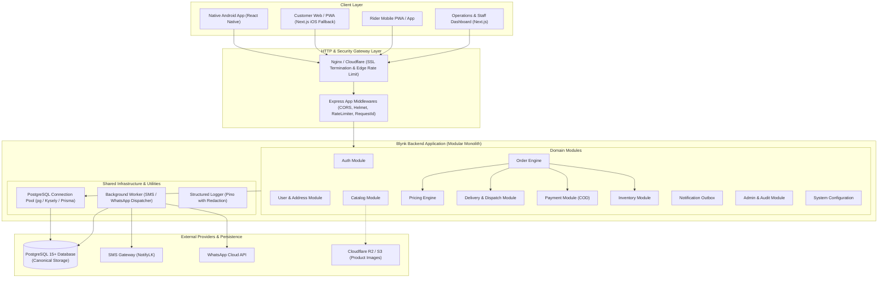
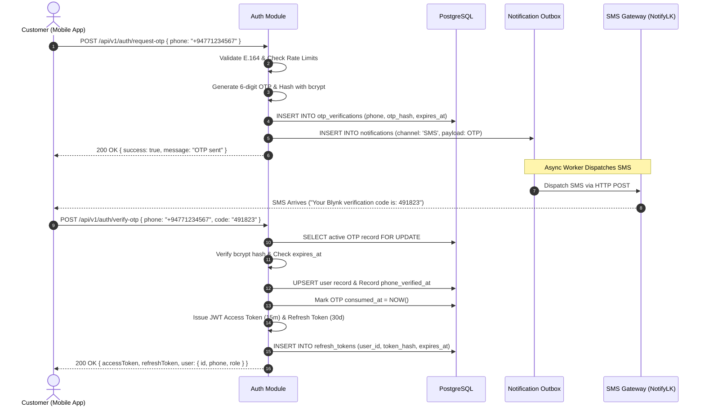
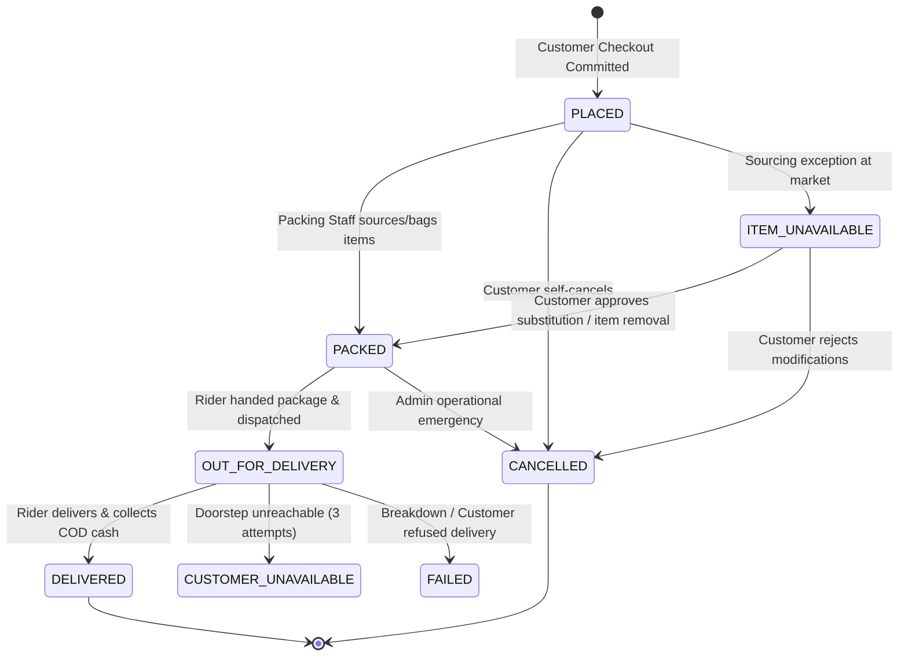
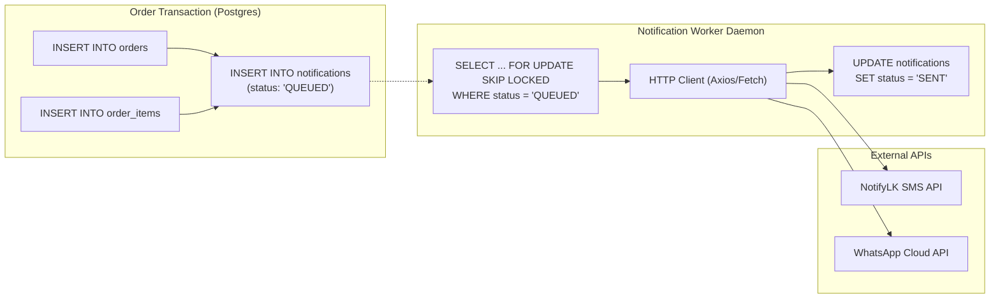

# Blynk Quick-Commerce Platform: Backend API Architecture Specification
**Author:** Senior Database Architect & Backend Platform Lead  
**Scope:** Phase 1 Launch (Dharga Town Hub) with Clean Multi-Store Extensibility  
**Target Runtime:** Node.js (v20 LTS) / TypeScript / PostgreSQL 15+  
**Architecture Style:** Modular Monolith (Clean Architecture within Domain Modules)  
**API Protocol:** RESTful over HTTP/2 (JSON Payloads, UTF-8, `/api/v1`)  
**Status:** Production API Specification & Architecture Contract  

---

## Executive Summary

This document defines the complete backend application architecture and API contract for **Blynk**, an owned-inventory grocery quick-commerce delivery platform launching in Dharga Town, Sri Lanka.

The backend is structured as a **strictly typed modular monolith** deployed as a single application unit connected to our unified PostgreSQL database. It cleanly segregates domain concerns into autonomous modules (auth, users, catalog, pricing, inventory, orders, payments, deliveries, riders, notifications, admin, audit, configurations) while strictly respecting the finalized, harmonized database architecture in [blynk_database_design.md](./blynk_database_design.md).

---

## SECTION A: High-Level Backend Architecture Diagram



---

## SECTION B: Domain Module Architecture & Responsibilities

The codebase is partitioned into discrete domain modules. Modules interact via explicit service boundaries; cross-module database operations occur inside coordinated database transactions.

| Module Name | Domain Scope & Technical Responsibilities | Inter-Module Dependencies |
|---|---|---|
| **`auth`** | OTP issuance, rate limiting, cryptographic verification (`bcrypt`/`argon2`), JWT access token generation (15 min), refresh token management (30 days), session revocation. | `users`, `notifications` |
| **`users`** | Customer profile lifecycle, phone verification status, customer address book CRUD, default address selection. | `auth` |
| **`catalog`** | Public category and product browsing, SKU/barcode lookup, unit/pack-size specifications, active/availability filtering, media URL resolution. | `pricing`, `categories` |
| **`pricing`** | Authoritative calculation of selling price using base purchase cost and effective markup (custom override or global 20%). Anti-tamper validation. | `configuration` |
| **`inventory`** | Stores on-hand and reserved counts per hub. Implements Phase 1 `UNTRACKED` (on-demand sourcing) and Phase 2 `TRACKED` warehouse logic with stock adjustment ledgers. | `catalog`, `dark_stores` |
| **`orders`** | Order validation, address snapshotting, after-hours scheduling (`scheduled_for`), atomic placement, cancellation gates, state machine progression, out-of-stock item resolution. | `pricing`, `inventory`, `payments`, `deliveries`, `notifications` |
| **`payments`** | Settlement lifecycle for Phase 1 Cash on Delivery (COD). Transition from `PENDING` to `PAID` upon rider confirmation; extensible for future online IPGs. | `orders` |
| **`deliveries`** | Order-to-rider assignment lifecycle, handover progression, active delivery locking, proof of cash collection, delivery failure notes. | `riders`, `orders` |
| **`riders`** | Rider user profile extension, vehicle registration details, shift availability toggle, assigned delivery queue querying. | `users`, `dark_stores` |
| **`notifications`** | Outbox pattern persistence, background worker polling with `FOR UPDATE SKIP LOCKED`, SMS/WhatsApp provider payload construction, retry handling, delivery status updates. | None (Asynchronous worker) |
| **`admin`** | Packing queue view, catalog modifications, manual rider assignments, ops cancellation overrides, daily financial reports. | All modules |
| **`audit`** | Lightweight, non-blocking capture of administrative mutations (price changes, manual stock adjustments, cancellations) into `audit_logs`. | All modules |
| **`configuration`**| In-memory cached access to platform operational constants (default markup percentage, delivery fee, operating hours). | None |
| **`dental`** *(added 2026-09-22)* | An independent vertical (not the grocery `orders` domain): clinic/doctor discovery, on-read availability computation from a weekly template, appointment hold/confirm/cancel with database-enforced double-booking prevention (partial unique index), and admin CRUD for clinics/doctors/availability/blocked dates. Booking only — no payment in Phase 1 (ADR-005). | `notifications` (confirmation/cancellation only) |

---

## SECTION C: Project Directory Structure

```
blynk-backend/
├── src/
│   ├── config/                      # Environment variables, app configuration
│   │   ├── env.ts                   # Zod-validated environment config
│   │   └── constants.ts             # Static system defaults
│   ├── database/                    # Persistence layer
│   │   ├── connection.ts            # PostgreSQL pool configuration
│   │   ├── migrate.ts               # Migration runner
│   │   └── migrations/              # SQL DDL files (matching blynk_database_design.md)
│   ├── middleware/                  # Global HTTP middleware
│   │   ├── auth.middleware.ts       # JWT authentication & req.user injection
│   │   ├── role.middleware.ts       # RBAC guards (CUSTOMER, RIDER, STAFF, ADMIN)
│   │   ├── error.middleware.ts      # RFC 7807 standard error formatting
│   │   ├── rate-limit.middleware.ts # IP & Phone throttlers
│   │   ├── request-id.middleware.ts # Correlation UUID injection
│   │   └── validate.middleware.ts   # Zod request schema validator
│   ├── modules/                     # Domain modules (Modular Monolith)
│   │   ├── auth/
│   │   │   ├── auth.controller.ts
│   │   │   ├── auth.service.ts
│   │   │   ├── auth.dto.ts
│   │   │   └── auth.routes.ts
│   │   ├── users/
│   │   │   ├── user.controller.ts
│   │   │   ├── user.service.ts
│   │   │   ├── address.service.ts
│   │   │   └── user.routes.ts
│   │   ├── catalog/
│   │   │   ├── catalog.controller.ts
│   │   │   ├── catalog.service.ts
│   │   │   └── catalog.routes.ts
│   │   ├── pricing/
│   │   │   ├── pricing.service.ts   # Authoritative markup & price calculator
│   │   │   └── pricing.types.ts
│   │   ├── inventory/
│   │   │   ├── inventory.controller.ts
│   │   │   ├── inventory.service.ts
│   │   │   └── inventory.routes.ts
│   │   ├── orders/
│   │   │   ├── order.controller.ts
│   │   │   ├── order.service.ts     # Checkout, cancellation & state machine
│   │   │   ├── order.dto.ts
│   │   │   └── order.routes.ts
│   │   ├── payments/
│   │   │   ├── payment.controller.ts
│   │   │   ├── payment.service.ts
│   │   │   └── payment.routes.ts
│   │   ├── deliveries/
│   │   │   ├── delivery.controller.ts
│   │   │   ├── delivery.service.ts
│   │   │   └── delivery.routes.ts
│   │   ├── riders/
│   │   │   ├── rider.controller.ts
│   │   │   ├── rider.service.ts
│   │   │   └── rider.routes.ts
│   │   ├── notifications/
│   │   │   ├── notification.service.ts
│   │   │   ├── notification.worker.ts # Outbox poller daemon
│   │   │   └── providers/           # NotifyLK & WhatsApp clients
│   │   ├── admin/
│   │   │   ├── admin.controller.ts
│   │   │   ├── admin.service.ts
│   │   │   └── admin.routes.ts
│   │   ├── configuration/
│   │   │   └── configuration.service.ts
│   │   └── dental/                  # Added 2026-09-22 — own domain, booking only, no payment
│   │       ├── dental.controller.ts / dental.repository.ts / dental.schema.ts
│   │       ├── clinic.service.ts / doctor.service.ts / availability.service.ts
│   │       ├── appointment.service.ts / appointment.repository.ts / appointment.controller.ts / appointment.schema.ts
│   │       ├── dental-admin.service.ts / dental-admin.repository.ts / dental-admin.controller.ts / dental-admin.schema.ts
│   │       └── index.ts             # mounts /dental and /admin/dental routers
│   ├── utils/                       # Shared pure utilities
│   │   ├── geo.ts                   # Haversine distance calculator
│   │   ├── phone.ts                 # E.164 phone normalizer (+94)
│   │   ├── time.ts                  # Asia/Colombo scheduling logic
│   │   └── logger.ts                # Pino structured logger with redaction
│   ├── app.ts                       # Express / Fastify app bootstrap
│   └── server.ts                    # HTTP server listener & graceful shutdown
├── tests/
│   ├── unit/                        # Pure service tests (pricing, geo, phone)
│   └── integration/                 # API endpoint & transactional DB tests
├── package.json
├── tsconfig.json
└── README.md
```

---

## SECTION D: Complete API Endpoint Matrix

All routes are version-prefixed with `/api/v1`.

### 1. Authentication (`/api/v1/auth`)
| Method | Endpoint | Auth / Role | Description |
|---|---|---|---|
| `POST` | `/auth/request-otp` | Public | Initiates phone authentication; generates and sends OTP. |
| `POST` | `/auth/verify-otp` | Public | Validates OTP hash; returns JWT access & refresh tokens. |
| `POST` | `/auth/refresh` | Public | Rotates refresh token and returns fresh access token. |
| `POST` | `/auth/logout` | Authenticated | Revokes refresh token session. |

### 2. Customer Profile & Addresses (`/api/v1/me`)
| Method | Endpoint | Auth / Role | Description |
|---|---|---|---|
| `GET` | `/me` | `CUSTOMER` | Returns current user profile details. |
| `PATCH` | `/me` | `CUSTOMER` | Updates user full name or email. |
| `GET` | `/me/addresses` | `CUSTOMER` | Lists customer's active delivery addresses. |
| `POST` | `/me/addresses` | `CUSTOMER` | Saves new address with GPS coordinates and instructions. |
| `GET` | `/me/addresses/:id` | `CUSTOMER` | Fetches single address (ownership enforced). |
| `PATCH` | `/me/addresses/:id` | `CUSTOMER` | Updates address details. |
| `DELETE` | `/me/addresses/:id` | `CUSTOMER` | Soft deletes address (`is_deleted = true`). |
| `POST` | `/me/addresses/:id/default`| `CUSTOMER` | Sets specified address as primary default. |

### 3. Catalog Browsing (`/api/v1`)
| Method | Endpoint | Auth / Role | Description |
|---|---|---|---|
| `GET` | `/categories` | Public | Lists active product categories with ordering. |
| `GET` | `/products` | Public | Paginated product search with category & availability filter. |
| `GET` | `/products/:id` | Public | Product details with calculated selling price. |

### 4. Orders & Checkout (`/api/v1/orders`)
| Method | Endpoint | Auth / Role | Description |
|---|---|---|---|
| `POST` | `/orders` | `CUSTOMER` | Authoritative checkout creation with idempotency key. |
| `GET` | `/orders` | `CUSTOMER` | Paginated customer order history. |
| `GET` | `/orders/:id` | `CUSTOMER` | Detailed order timeline, address snapshot, and line items. |
| `POST` | `/orders/:id/cancel` | `CUSTOMER` | Cancels order (permitted only if status is `PLACED` or `PACKED`). |

### 5. Rider Operations (`/api/v1/rider`)
| Method | Endpoint | Auth / Role | Description |
|---|---|---|---|
| `GET` | `/rider/me` | `RIDER` | Rider profile, hub affiliation, vehicle details. |
| `PATCH` | `/rider/me/status` | `RIDER` | Toggles availability (`is_available: true/false`). |
| `GET` | `/rider/deliveries` | `RIDER` | Active assignments currently dispatched to the rider. |
| `GET` | `/rider/deliveries/:id`| `RIDER` | Delivery details with customer location & doorstep directions. |
| `PATCH` | `/rider/deliveries/:id/status` | `RIDER` | Transitions delivery state (`PICKED_UP`, `ARRIVED_AT_CUSTOMER`, `DELIVERED`, `FAILED`). |
| `POST` | `/rider/deliveries/:id/collect-cod` | `RIDER` | Confirms COD cash received and completes delivery. |

### 6. Admin & Store Operations (`/api/v1/admin`)
| Method | Endpoint | Auth / Role | Description |
|---|---|---|---|
| `GET` | `/admin/packing-queue` | `STAFF`, `ADMIN` | Real-time queue of orders awaiting packing and sourcing. |
| `GET` | `/admin/orders` | `STAFF`, `ADMIN` | Multi-status filtered order list with pagination. |
| `GET` | `/admin/orders/:id` | `STAFF`, `ADMIN` | Complete order drill-down including audit trail. |
| `PATCH` | `/admin/orders/:id/status` | `STAFF`, `ADMIN` | Transitions order to `PACKED` or emergency `CANCELLED`. |
| `PATCH` | `/admin/orders/:id/items/:itemId` | `STAFF`, `ADMIN` | Resolves item availability (`UNAVAILABLE`, `SUBSTITUTED`, updates actual cost). |
| `POST` | `/admin/orders/:id/assign-rider` | `ADMIN` | Manually assigns order to a specific rider. |
| `GET` | `/admin/riders` | `ADMIN` | Lists all riders, vehicle numbers, and current online status. |
| `POST` | `/admin/riders` | `ADMIN` | Creates new rider profile. |
| `GET` | `/admin/inventory` | `STAFF`, `ADMIN` | Views stock on hand and tracking modes. |
| `POST` | `/admin/inventory/adjust` | `STAFF`, `ADMIN` | Logs physical inventory audit delta. |
| `POST` | `/admin/products` | `ADMIN` | Creates new SKU with base cost and markup override. |
| `PATCH` | `/admin/products/:id` | `ADMIN` | Updates price, availability, or status. |
| `GET` | `/admin/reports/daily-sales` | `ADMIN` | Daily sales, COGS, and gross profit breakdown. |
| `GET` | `/admin/audit-logs` | `ADMIN` | Searchable administrative change logs. |
| `GET` | `/admin/configurations` | `ADMIN` | Views dynamic system parameters. |
| `PATCH` | `/admin/configurations` | `ADMIN` | Updates delivery fee or default markup percentage. |

---

## SECTION E: Authentication Architecture & Token Security

### Security Invariants
- **No Plaintext OTPs**: OTPs are generated as cryptographically secure 6-digit random strings, immediately hashed using `bcrypt` (or `argon2id`), and stored in `otp_verifications`.
- **Account Enumeration Protection**: `/auth/request-otp` returns identical success payloads whether the phone number was previously registered or new.
- **Throttling & Lockout**:
  - Max 3 verification attempts per OTP record (`chk_otp_attempts`).
  - IP-based rate limit: Max 5 OTP requests per 15 minutes.
  - Phone-based rate limit: 60-second cooldown between requests.
- **Token Specifications**:
  - **Access Token**: Short-lived JWT (15-minute expiry). Signed with RSA256 or HS256 (minimum 256-bit secret). Payload: `{ sub: user_id, role: user_role, phone: phone }`.
  - **Refresh Token**: Long-lived opaque cryptographic token (30-day expiry). Stored hashed in `refresh_tokens`. Rotated on every use.



---

## SECTION F: Checkout & Authoritative Order Creation

### Critical Invariant: Zero Trust in Client-Side Pricing
The frontend client maintains cart state locally and merely transmits an array of `{ product_id, quantity }` and an `address_id`. The backend is the **sole authority** for prices, delivery fees, geofence radius, and subtotal calculations.

### Atomic Order Creation Transaction Pipeline

```mermaid
sequenceDiagram
    autonumber
    actor Client as Customer (App)
    participant API as Order Module
    participant Pricing as Pricing Engine
    participant DB as PostgreSQL (Single Transaction)
    participant Outbox as Notification Outbox

    Client->>API: POST /api/v1/orders { idempotency_key, address_id, items: [...] }
    API->>DB: Check idempotency_key in orders table
    alt Key already exists
        API->>DB: SELECT cached order details
        API-->>Client: 200 OK (Replayed previous order response)
    end

    API->>DB: BEGIN TRANSACTION (ISOLATION LEVEL READ COMMITTED)
    API->>DB: Fetch customer_addresses WHERE id = address_id AND user_id = req.user.id
    API->>API: Compute Haversine distance to Dark Store (Dharga Town Hub)
    alt Distance > 4.00 km
        API-->>Client: 422 Unprocessable Entity ("Delivery address is outside the 4 km service zone")
    end

    API->>API: Evaluate local time (Asia/Colombo) against 08:00 - 21:00
    Note over API: If outside window, scheduled_for = Next 08:00 AM

    API->>DB: Lock & fetch products for product_ids in items
    API->>Pricing: Calculate authoritative unit_selling_price for each SKU
    API->>DB: Read delivery_fee from system_configurations (70.00 LKR)
    API->>API: Sum line items into subtotal_amount; total_amount = subtotal + fee

    API->>DB: INSERT INTO orders (with denormalized address snapshot, scheduled_for)
    API->>DB: INSERT INTO order_items (snapshot unit_selling_price, estimated_unit_cost, markup)
    API->>DB: INSERT INTO payments (order_id, payment_method: 'COD', payment_status: 'PENDING')
    API->>DB: INSERT INTO order_status_history (order_id, old_status: NULL, new_status: 'PLACED')
    API->>DB: COMMIT TRANSACTION

    Note over API,Outbox: Post-Commit Safe Queueing
    API->>Outbox: INSERT INTO notifications (channel: 'SMS', type: 'ORDER_PLACED')
    API-->>Client: 201 Created { order_number, total_amount, status: "PLACED" }
```

---

## SECTION G: Order State Machine & Transition Rules

### Canonical Lifecycle States
- **Primary Happy Path**: `PLACED` $\longrightarrow$ `PACKED` $\longrightarrow$ `OUT_FOR_DELIVERY` $\longrightarrow$ `DELIVERED`
- **Exceptions**: `CANCELLED`, `FAILED`, `CUSTOMER_UNAVAILABLE`, `ITEM_UNAVAILABLE`



### Transition Enforcement Matrix (Evaluated in Service Layer)

| Current Status | Target Status | Authorized Actors | Conditions / Business Invariants |
|---|---|---|---|
| `[None]` | `PLACED` | `CUSTOMER` | Valid items, within 4 km, valid address snapshot. |
| `PLACED` | `PACKED` | `STAFF`, `ADMIN` | All items sourced and bagged. `actual_unit_cost` recorded on items. |
| `PLACED` | `CANCELLED` | `CUSTOMER`, `ADMIN`| Customer self-cancellation allowed before dispatch. |
| `PLACED` | `ITEM_UNAVAILABLE`| `STAFF`, `ADMIN`| Local vendor out of stock. Staff triggers customer contact workflow. |
| `ITEM_UNAVAILABLE` | `PACKED` | `STAFF`, `ADMIN` | Item substitution or removal confirmed by customer; totals adjusted. |
| `ITEM_UNAVAILABLE` | `CANCELLED` | `CUSTOMER`, `ADMIN`| Customer refuses alternatives; order voided. |
| `PACKED` | `OUT_FOR_DELIVERY`| `STAFF`, `ADMIN`| Active rider assigned in `deliveries`. **Customer cancellation blocked.** |
| `PACKED` | `CANCELLED` | `ADMIN` | Ops emergency only. |
| `OUT_FOR_DELIVERY` | `DELIVERED` | `RIDER`, `ADMIN` | Rider confirms cash collected in app. Handover complete. |
| `OUT_FOR_DELIVERY` | `CUSTOMER_UNAVAILABLE`| `RIDER`, `ADMIN`| Customer unreachable at doorstep after 3 phone attempts. |
| `OUT_FOR_DELIVERY` | `FAILED` | `RIDER`, `ADMIN` | Vehicle breakdown, accident, or recipient outright refusal. |

---

## SECTION H: Rider Assignment Architecture

In Phase 1, assignment is **strictly manual** (store manager selects a rider from the dashboard).

### Safe Reassignment via Partial Unique Index
The database enforces:
```sql
CREATE UNIQUE INDEX uq_deliveries_active_assignment ON deliveries (order_id)
WHERE assignment_status NOT IN ('FAILED', 'REJECTED');
```

### Operational Workflow:
1. **Initial Assignment**:
   - Manager clicks "Assign Farhan" on `POST /api/v1/admin/orders/:id/assign-rider`.
   - Backend checks that the order is `PACKED`.
   - Inserts row into `deliveries`: `rider_id = Farhan`, `assignment_status = 'ASSIGNED'`.
2. **Breakdown / Rejection Exception**:
   - Farhan's motorbike breaks down on route. Farhan flags delivery as `FAILED` (or manager updates it).
   - `assignment_status` becomes `'FAILED'`.
   - Because of the partial unique index, the order no longer has an *active* delivery row.
   - The manager can immediately assign Rider 2 (Nawaz):
     ```sql
     INSERT INTO deliveries (order_id, rider_id, assignment_status)
     VALUES (:orderId, :rider2Id, 'ASSIGNED');
     ```
   - Historical records of Farhan's failed attempt remain intact for reporting, while Nawaz takes over without violating relational integrity.

---

## SECTION I: Cash on Delivery (COD) Payment Flow

Phase 1 payment method is **strictly Cash on Delivery**.

### Settlement Integrity Rules
1. **At Order Placement**:
   - `orders.payment_method = 'COD'`
   - `orders.payment_status = 'PENDING'`
   - `payments` row created: `amount = orders.total_amount`, `payment_status = 'PENDING'`.
2. **At Doorstep Handover**:
   - Rider arrives, hands over bag, and counts cash.
   - Rider opens app and taps "Confirm Cash Collection" on `POST /api/v1/rider/deliveries/:id/collect-cod`.
3. **Atomic Settlement Execution**:
   ```sql
   BEGIN;
   -- 1. Update delivery record
   UPDATE deliveries
   SET assignment_status = 'DELIVERED',
       cod_collected_amount = :orderTotal,
       delivered_at = CURRENT_TIMESTAMP
   WHERE id = :deliveryId AND assignment_status = 'ARRIVED_AT_CUSTOMER';

   -- 2. Mark payment paid
   UPDATE payments
   SET payment_status = 'PAID',
       paid_at = CURRENT_TIMESTAMP,
       transaction_reference = :riderReceiptRef
   WHERE order_id = :orderId;

   -- 3. Mark order delivered
   UPDATE orders
   SET order_status = 'DELIVERED',
       payment_status = 'PAID',
       delivered_at = CURRENT_TIMESTAMP
   WHERE id = :orderId;

   -- 4. Record history
   INSERT INTO order_status_history (order_id, old_status, new_status, changed_by_user_id, reason_or_notes)
   VALUES (:orderId, 'OUT_FOR_DELIVERY', 'DELIVERED', :riderUserId, 'Cash collected by rider at doorstep');

   COMMIT;
   ```
4. **Duplicate Protection**: If already `PAID`, subsequent calls return HTTP 409 Conflict.

---

## SECTION J: Outbox Notification Architecture

### Core Invariant: Decoupled Third-Party Dependencies
An outage or latency spike in the SMS provider (NotifyLK) or WhatsApp Cloud API must **never** block, delay, or roll back customer order checkout.



### Worker Implementation Spec:
- A lightweight setInterval poller running every 3 seconds:
  ```sql
  SELECT id, channel, recipient, payload 
  FROM notifications 
  WHERE status = 'QUEUED' 
  ORDER BY created_at ASC 
  LIMIT 20 
  FOR UPDATE SKIP LOCKED;
  ```
- **Idempotency**: Notification rows store `idempotency_key` (e.g. `order_<ID>_OUT_FOR_DELIVERY_SMS`). If retried due to worker restart, duplicate dispatches are suppressed.

---

## SECTION K: Out-of-Stock Resolution Workflow

When store staff discovers an item cannot be sourced in Dharga Town markets:

1. **Staff Flags Item**:
   - `PATCH /api/v1/admin/orders/:id/items/:itemId` with `{ item_status: "UNAVAILABLE" }`.
   - Order transitions to `ITEM_UNAVAILABLE`.
2. **Operations Contacts Customer**:
   - Staff dials customer phone number from the dashboard.
   - **Scenario A (Customer Agrees to Remove Item)**:
     - Staff confirms item removal via API.
     - Backend recalculates:
       $$\text{new\_subtotal} = \text{subtotal} - \text{removed\_item\_price}$$
       $$\text{new\_total} = \text{new\_subtotal} + \text{delivery\_fee}$$
     - `orders.subtotal_amount`, `orders.total_amount`, and `payments.amount` updated inside a transaction.
     - Order transitions to `PACKED`.
   - **Scenario B (Customer Replaces with Alternative SKU)**:
     - Staff adds substitution item to order. Original item marked `SUBSTITUTED`.
     - Order totals recalculated.
     - Order transitions to `PACKED`.
   - **Scenario C (Customer Rejects Order)**:
     - Order cancelled via `POST /api/v1/admin/orders/:id/status` with `{ status: "CANCELLED", reason: "Item out of stock; customer requested cancellation" }`.
3. **Dispatch Gate**: The backend **strictly forbids** moving an order to `OUT_FOR_DELIVERY` if any line item remains in `UNAVAILABLE` state without recalculated totals.

---

## SECTION L: After-Hours 24/7 Ordering & Operating Window

### Business Rules:
- Customers can place orders 24 hours a day, 7 days a week.
- Delivery operations run strictly **8:00 AM – 9:00 PM** (`Asia/Colombo`).

### Backend Scheduling Logic (`src/utils/time.ts`):
```typescript
import { DateTime } from 'luxon';

export function calculateScheduledWindow(placedAtUtc: Date): Date | null {
  const localTime = DateTime.fromJSDate(placedAtUtc).setZone('Asia/Colombo');
  const startHour = 8;
  const endHour = 21; // 9:00 PM

  // If within operating hours, dispatch is immediate (scheduled_for remains null)
  if (localTime.hour >= startHour && localTime.hour < endHour) {
    return null;
  }

  // If placed before 8:00 AM today, schedule for 8:00 AM today
  if (localTime.hour < startHour) {
    return localTime.set({ hour: startHour, minute: 0, second: 0, millisecond: 0 }).toJSDate();
  }

  // If placed at or after 9:00 PM, schedule for 8:00 AM the next morning
  return localTime.plus({ days: 1 }).set({ hour: startHour, minute: 0, second: 0, millisecond: 0 }).toJSDate();
}
```

---

## SECTION M: Geofence Validation (4 km Haversine)

The backend calculates geodesic distance without PostGIS using the Haversine formula (`src/utils/geo.ts`):

$$\Delta\sigma = 2 \arcsin \sqrt{\sin^2\left(\frac{\Delta\phi}{2}\right) + \cos\phi_1 \cos\phi_2 \sin^2\left(\frac{\Delta\lambda}{2}\right)}$$
$$d = R \cdot \Delta\sigma \quad (\text{where } R = 6371.00\text{ km})$$

### Service Implementation:
```typescript
export function calculateHaversineKm(lat1: number, lon1: number, lat2: number, lon2: number): number {
  const toRad = (deg: number) => (deg * Math.PI) / 180;
  const R = 6371; // Earth's mean radius in km

  const dLat = toRad(lat2 - lat1);
  const dLon = toRad(lon2 - lon1);
  const a =
    Math.sin(dLat / 2) * Math.sin(dLat / 2) +
    Math.cos(toRad(lat1)) * Math.cos(toRad(lat2)) * Math.sin(dLon / 2) * Math.sin(dLon / 2);

  const c = 2 * Math.atan2(Math.sqrt(a), Math.sqrt(1 - a));
  return Number((R * c).toFixed(3));
}
```
If calculated distance exceeds `dark_stores.radius_km` (4.00 km), checkout is rejected with HTTP 422.

---

## SECTION N: Role-Based Access Control (RBAC) Matrix

| Endpoint Route Pattern | `CUSTOMER` | `RIDER` | `PACKING_STAFF` | `ADMIN` |
|---|:---:|:---:|:---:|:---:|
| `/api/v1/me/**` | ✅ (Own data) | ❌ | ❌ | ❌ |
| `/api/v1/orders` (`POST`, `GET`) | ✅ (Own orders)| ❌ | ❌ | ✅ |
| `/api/v1/orders/:id/cancel` | ✅ (If Placed/Packed) | ❌ | ❌ | ✅ |
| `/api/v1/rider/**` | ❌ | ✅ (Own assignments) | ❌ | ✅ |
| `/api/v1/admin/packing-queue` | ❌ | ❌ | ✅ | ✅ |
| `/api/v1/admin/orders/:id/items/:itemId` | ❌ | ❌ | ✅ | ✅ |
| `/api/v1/admin/orders/:id/assign-rider` | ❌ | ❌ | ❌ | ✅ |
| `/api/v1/admin/products/**` | ❌ | ❌ | ❌ | ✅ |
| `/api/v1/admin/configurations/**` | ❌ | ❌ | ❌ | ✅ |
| `/api/v1/admin/reports/**` | ❌ | ❌ | ❌ | ✅ |

---

## SECTION O: API Error Standard (RFC 7807 Inspired)

All non-2xx API responses strictly adhere to this standardized JSON format:

```json
{
  "success": false,
  "error": {
    "code": "ORDER_ALREADY_OUT_FOR_DELIVERY",
    "message": "Order is already out for delivery and cannot be cancelled online. Please contact customer support.",
    "details": null,
    "timestamp": "2026-09-14T16:30:00.000Z",
    "requestId": "req_99b128df-4a92-411a-a82f-871d3a54b981"
  }
}
```

### Standard Status Code Mapping:
- **`400 Bad Request`**: Validation syntax failure (`INVALID_PHONE_FORMAT`, `MALFORMED_JSON`).
- **`401 Unauthorized`**: Missing, expired, or corrupted JWT access token (`UNAUTHORIZED`).
- **`403 Forbidden`**: Insufficient permissions / IDOR access attempt (`FORBIDDEN`).
- **`404 Not Found`**: Resource does not exist (`PRODUCT_NOT_FOUND`, `ORDER_NOT_FOUND`).
- **`409 Conflict`**: State violation or unique conflict (`DUPLICATE_ORDER_ATTEMPT`, `ALREADY_PAID`).
- **`422 Unprocessable Entity`**: Business rule failure (`ADDRESS_OUTSIDE_RADIUS`, `INVALID_STATUS_TRANSITION`).
- **`429 Too Many Requests`**: Rate limit exceeded (`RATE_LIMIT_EXCEEDED`).
- **`500 Internal Server Error`**: Unhandled exception (`INTERNAL_SERVER_ERROR`).

---

## SECTION P: Input Validation & Phone Number Normalization

### Sri Lanka Phone Number Normalization Rule
All inputs representing phone numbers must pass through the normalizer before querying or inserting (`src/utils/phone.ts`):
- `077 123 4567` $\longrightarrow$ `+94771234567`
- `94771234567` $\longrightarrow$ `+94771234567`
- `+94771234567` $\longrightarrow$ `+94771234567`
- Any number not matching `/^\+94(70|71|72|74|75|76|77|78)[0-9]{7}$/` throws `INVALID_SRI_LANKAN_MOBILE`.

### Schema Validation with Zod
```typescript
import { z } from 'zod';

export const CreateOrderSchema = z.object({
  idempotency_key: z.string().min(8).max(128),
  address_id: z.string().uuid(),
  customer_notes: z.string().max(500).optional(),
  items: z
    .array(
      z.object({
        product_id: z.string().uuid(),
        quantity: z.number().int().positive().max(50),
      })
    )
    .min(1)
    .max(50),
});
```

---

## SECTION Q: Idempotency Handling Architecture

### Workflow for Mobile Retry Handling
1. Mobile app creates a unique UUID v4 string for the checkout session.
2. App sends: `POST /api/v1/orders` with `idempotency_key = "idemp_d489b02a-7512-4c28-9418-54b9f2"` in the payload.
3. If mobile connectivity drops before the response is received, the app re-sends the exact same request.
4. **Backend Processing**:
   ```sql
   SELECT id, order_number, order_status, total_amount, placed_at 
   FROM orders 
   WHERE idempotency_key = :idempotencyKey;
   ```
5. If a record is found, the backend bypasses calculation, avoids duplicate charging, and immediately returns the previously committed order payload with HTTP 200 OK (`replayed: true`).

---

## SECTION R: Security Architecture & IDOR Defenses

1. **Insecure Direct Object Reference (IDOR) Prevention**:
   - A customer querying `/orders/:id` or `/me/addresses/:id` has their query scoped by their authenticated session:
     ```sql
     SELECT * FROM orders WHERE id = :orderId AND customer_id = :authenticatedUserId;
     ```
   - Returning `404 Not Found` if not owned by the user prevents attackers from detecting whether an order ID exists.
2. **CORS & Security Headers**:
   - `helmet` middleware active (HSTS, frameguard, XSS filter, no-sniff).
   - Strict CORS origin whitelisting: Only authorized web domain and mobile app custom schemes.
3. **Redaction in Structured Logs**:
   - Pino configured with strict redaction paths:
     `['req.headers.authorization', 'req.body.otp', 'req.body.code', 'user.phone']`.

---

## SECTION S: Observability & Logging Standard

Logs are output to `stdout` in structured JSON format (Pino):
```json
{
  "level": 30,
  "time": 1773504896000,
  "pid": 1042,
  "hostname": "blynk-core-01",
  "requestId": "req_5f812b1a-829d-4819-bf91-1123498bca12",
  "userId": "u0100000-0000-0000-0000-000000000001",
  "orderId": "o0100000-0000-0000-0000-000000000001",
  "method": "POST",
  "url": "/api/v1/orders",
  "statusCode": 201,
  "durationMs": 42.8,
  "msg": "Order created successfully"
}
```

---

## SECTION T: Production API Payloads (Request / Response Contracts)

### 1. Verify OTP (`POST /api/v1/auth/verify-otp`)
#### Request:
```json
{
  "phone": "+94771234567",
  "code": "491823"
}
```
#### Response (`200 OK`):
```json
{
  "success": true,
  "data": {
    "accessToken": "eyJhbGciOiJIUzI1NiIsInR5cCI6IkpXVCJ9...",
    "refreshToken": "ref_88b12f49182a472c9182c18273918273",
    "user": {
      "id": "u0100000-0000-0000-0000-000000000001",
      "phone": "+94771234567",
      "fullName": "Ahmed Rizvi",
      "role": "CUSTOMER"
    }
  }
}
```

### 2. Get Products (`GET /api/v1/products?categoryId=c0100000-0000-0000-0000-000000000001&page=1&limit=10`)
#### Response (`200 OK`):
```json
{
  "success": true,
  "data": {
    "items": [
      {
        "id": "p0100000-0000-0000-0000-000000000001",
        "name": "Kotmale Fresh Milk 1L",
        "slug": "kotmale-fresh-milk-1l",
        "sku": "SKU-DAI-001",
        "unit": "1 L",
        "packSize": "Tetra Pack",
        "imageUrl": "https://assets.blynk.lk/products/kotmale-milk-1l.webp",
        "sellingPrice": 540.00,
        "isAvailable": true
      }
    ],
    "pagination": {
      "page": 1,
      "limit": 10,
      "totalItems": 1,
      "totalPages": 1
    }
  }
}
```

### 3. Create Order (`POST /api/v1/orders`)
#### Request:
```json
{
  "idempotency_key": "idemp_checkout_9918231278",
  "address_id": "a0100000-0000-0000-0000-000000000001",
  "customer_notes": "Please call when outside the gate.",
  "items": [
    {
      "product_id": "p0100000-0000-0000-0000-000000000001",
      "quantity": 1
    },
    {
      "product_id": "p0100000-0000-0000-0000-000000000004",
      "quantity": 2
    }
  ]
}
```
#### Response (`201 Created`):
```json
{
  "success": true,
  "data": {
    "orderId": "o0100000-0000-0000-0000-000000000001",
    "orderNumber": "BLK-20260914-0001",
    "orderStatus": "PLACED",
    "paymentMethod": "COD",
    "paymentStatus": "PENDING",
    "subtotalAmount": 1500.00,
    "deliveryFee": 70.00,
    "totalAmount": 1570.00,
    "scheduledFor": null,
    "placedAt": "2026-09-14T16:35:00.000Z",
    "deliveryAddress": {
      "recipientName": "Ahmed Rizvi",
      "recipientPhone": "+94771234567",
      "addressLine1": "No. 18, Marikar Street",
      "city": "Dharga Town",
      "latitude": 6.435100,
      "longitude": 80.024300
    }
  }
}
```

### 4. Get Single Order (`GET /api/v1/orders/:id`)
#### Response (`200 OK`):
```json
{
  "success": true,
  "data": {
    "orderId": "o0100000-0000-0000-0000-000000000001",
    "orderNumber": "BLK-20260914-0001",
    "orderStatus": "PACKED",
    "paymentStatus": "PENDING",
    "totalAmount": 1570.00,
    "items": [
      {
        "id": "i0100000-0000-0000-0000-000000000001",
        "name": "Kotmale Fresh Milk 1L",
        "quantity": 1,
        "unitSellingPrice": 540.00,
        "subtotal": 540.00,
        "status": "PACKED"
      }
    ],
    "timeline": [
      { "status": "PLACED", "timestamp": "2026-09-14T16:35:00.000Z" },
      { "status": "PACKED", "timestamp": "2026-09-14T16:42:10.000Z" }
    ]
  }
}
```

### 5. Cancel Order (`POST /api/v1/orders/:id/cancel`)
#### Request:
```json
{
  "reason": "Placed by mistake; needed different items."
}
```
#### Response (`200 OK`):
```json
{
  "success": true,
  "data": {
    "orderId": "o0100000-0000-0000-0000-000000000001",
    "orderStatus": "CANCELLED",
    "cancelledAt": "2026-09-14T16:44:00.000Z"
  }
}
```

> **Update (2026-09-19, Customer Order Experience phase):** the real implementation's customer order responses (list, detail, create, cancel — see `sanitizeCustomerOrder` in `backend/api/src/modules/orders/order.service.ts`) use snake_case field names, not the camelCase shown in the two examples above, and additionally carry `can_cancel: boolean` — whether the customer may call `POST /orders/:id/cancel` right now. It is derived from the same lifecycle catalogue the cancel action itself checks under the order lock (`CATALOGUE.CUSTOMER_CANCEL.from`, currently `PLACED`/`PACKED`), so the client never keeps its own copy of the rule; the field is advisory only — the cancel endpoint remains the sole authority and refuses a stale `true` with its existing error codes (`ORDER_ALREADY_OUT_FOR_DELIVERY`, `ORDER_ALREADY_CANCELLED`, `ORDER_CANNOT_BE_CANCELLED`). The detail response also carries `history[]` (`{id, order_id, old_status, new_status, created_at}`, D11: no staff notes or actor) and, when a delivery exists, `delivery {assignment_status, assigned_at, picked_up_at, delivered_at}` — no rider identity or location.

### 6. Update Order Status to Packed (`PATCH /api/v1/admin/orders/:id/status`)
#### Request:
```json
{
  "status": "PACKED",
  "notes": "Sourced from central hub; packed in Bag #4"
}
```
#### Response (`200 OK`):
```json
{
  "success": true,
  "data": {
    "orderId": "o0100000-0000-0000-0000-000000000001",
    "orderStatus": "PACKED",
    "packedAt": "2026-09-14T16:45:00.000Z"
  }
}
```

### 7. Assign Rider (`POST /api/v1/admin/orders/:id/assign-rider`)
#### Request:
```json
{
  "riderId": "r0100000-0000-0000-0000-000000000001"
}
```
#### Response (`200 OK`):
```json
{
  "success": true,
  "data": {
    "deliveryId": "d0100000-0000-0000-0000-000000000001",
    "orderId": "o0100000-0000-0000-0000-000000000001",
    "riderId": "r0100000-0000-0000-0000-000000000001",
    "assignmentStatus": "ASSIGNED",
    "assignedAt": "2026-09-14T16:46:00.000Z"
  }
}
```

### 8. Update Delivery Status to Out For Delivery (`PATCH /api/v1/rider/deliveries/:id/status`)
#### Request:
```json
{
  "status": "PICKED_UP"
}
```
#### Response (`200 OK`):
```json
{
  "success": true,
  "data": {
    "deliveryId": "d0100000-0000-0000-0000-000000000001",
    "assignmentStatus": "PICKED_UP",
    "orderStatus": "OUT_FOR_DELIVERY",
    "pickedUpAt": "2026-09-14T16:47:30.000Z"
  }
}
```

### 9. Confirm COD Cash Collection (`POST /api/v1/rider/deliveries/:id/collect-cod`)
#### Request:
```json
{
  "amountCollected": 1570.00,
  "handoverNotes": "Exact cash given by customer."
}
```
#### Response (`200 OK`):
```json
{
  "success": true,
  "data": {
    "deliveryId": "d0100000-0000-0000-0000-000000000001",
    "orderId": "o0100000-0000-0000-0000-000000000001",
    "orderStatus": "DELIVERED",
    "paymentStatus": "PAID",
    "codCollectedAmount": 1570.00,
    "deliveredAt": "2026-09-14T17:05:00.000Z"
  }
}
```

---

## SECTION U: Final Verification Against Business Invariants

- [x] **Dharga Town Centric**: Dark store hub seeded with Dharga Town central coordinates (`6.438200, 80.027400`).
- [x] **1 Dark Store Initial**: Hub resolution routes to `DHARGA-01` in Phase 1 with multi-store routing ready.
- [x] **4 km Radius**: Backend Haversine calculates distance; rejects checkout > 4.00 km with HTTP 422.
- [x] **70 LKR Delivery Fee**: Read dynamically from `system_configurations` and snapshotted into `orders.delivery_fee`.
- [x] **No Minimum Order**: Zero minimum order restrictions on checkout payload.
- [x] **20% Default Markup & Override**: Pricing engine computes $P \times (1 + M/100)$; overrides applied per-product.
- [x] **Actual Procurement Cost**: `order_items.estimated_unit_cost` and `actual_unit_cost` dual snapshot preserved.
- [x] **COD Settlement**: Seamless state shift from `PENDING` to `PAID` upon rider doorstep confirmation.
- [x] **1–2 Riders**: Lean schema with manual assignment endpoints and single-active-rider partial unique index.
- [x] **SMS + WhatsApp**: Outbox pattern completely isolates third-party downtime from order placement.
- [x] **24/7 Ordering**: `scheduled_for` calculated for after-hours orders based on `Asia/Colombo` 8 AM – 9 PM window.
- [x] **Customer Cancellation Cutoff**: Allowed in `PLACED` and `PACKED`; blocked with HTTP 422 once `OUT_FOR_DELIVERY`.
- [x] **Out-of-Stock Workflow**: Dedicated API for flagging `UNAVAILABLE`, recalculating totals, and customer contact.
- [x] **Client-Side Cart**: No database cart clutter; clients submit items directly to `POST /api/v1/orders`.
- [x] **Modular Monolith in Node.js/TypeScript**: No microservices, Kafka, Kubernetes, or event sourcing.

---

## BACKEND DESIGN STATUS:
### **READY FOR IMPLEMENTATION**
