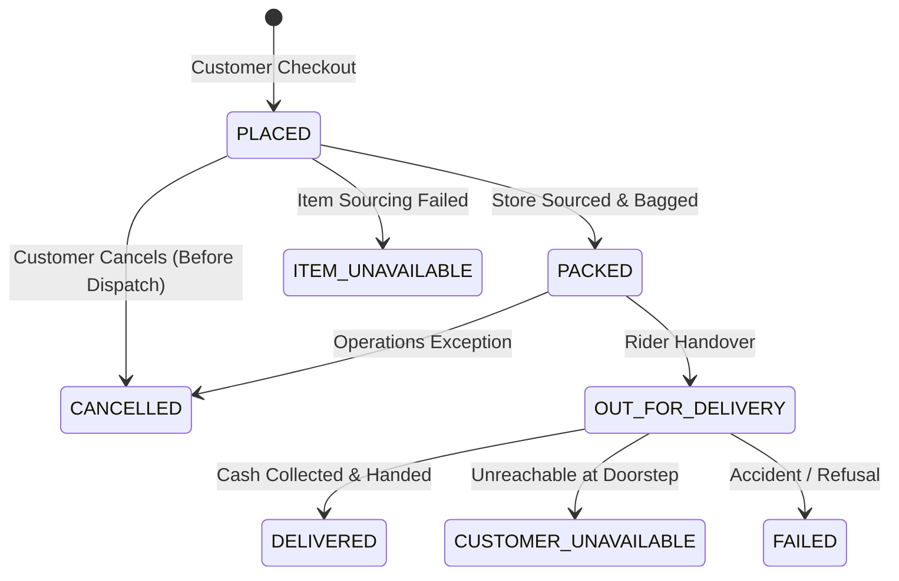

# Blynk Quick-Commerce Platform: PostgreSQL Database Architecture Document
**Author:** Senior Database Architect & Backend Platform Team  
**Scope:** Phase 1 Production Baseline (Dharga Town Hub Launch) with Zero-Migration Multi-Store Extensibility  
**Target Engine:** PostgreSQL 15+ / 16  
**Status:** Production Design Specification (Post-Audit Harmonized Version)  

---

## Executive Summary & Design Principles

This document specifies the complete, production-ready relational database schema for **Blynk**, an owned-inventory grocery quick-commerce delivery platform launching in Dharga Town, Sri Lanka.

### Core Architectural Invariants

1. **Modular Monolith Data Architecture**:
   - Single PostgreSQL instance hosting a unified, cleanly segregated relational schema.
   - Eliminates distributed transaction failures, network serialization penalties, and multi-database sprawl.

2. **Primary Key Strategy: `UUID v4` (`gen_random_uuid()`)**:
   - **Security**: Prevents sequential enumeration attacks (competitors cannot scrape order velocity from incrementing integer IDs).
   - **Client/Offline Generation**: Allows safe client-side idempotency and distributed key generation without round-tripping to database sequences.
   - **Multi-Store Scaling**: Guarantees zero primary key collisions when merging future dark-store nodes or sharding read replicas.

3. **Currency & Financial Integrity: `NUMERIC(10, 2)`**:
   - Strict fixed-point representation for all Sri Lankan Rupee (LKR) amounts. Never uses floating-point types (`FLOAT`, `REAL`).
   - Handles transactions up to 99,999,999.99 LKR with zero IEEE 754 precision drift.

4. **Timezone Preservation: `TIMESTAMPTZ` (UTC)**:
   - All timestamps are stored strictly in UTC as `TIMESTAMPTZ`.
   - Local Sri Lanka standard time (`Asia/Colombo`, UTC+05:30) is applied at the API presentation and reporting layer.

5. **Historical Immutability & Snapshots**:
   - **Address Snapshot**: `orders` denormalizes recipient and location details directly into order columns. Modifying or deleting customer address entries in `customer_addresses` has zero impact on historical orders.
   - **Price & Cost Dual Snapshot**: `order_items` snapshots `unit_selling_price`, `estimated_unit_cost` (catalog cost at order placement), and `actual_unit_cost` (real procurement cost recorded during on-demand sourcing/packing). Historical gross profit analysis remains 100% auditable and immutable.

6. **Phase-1 Spatial Decision: Coordinates + Haversine (No PostGIS)**:
   - Coordinates (`latitude`, `longitude`) are stored as `NUMERIC(9, 6)`.
   - The backend service computes geodesic distance to the dark store using the standard Haversine formula against `dark_stores.radius_km` (4.00 km). PostGIS is deferred to Phase 2/3 if complex polygon geofencing is adopted.

7. **Clean Division of Responsibility**:
   - **Database Enforces**: Structural relational constraints (FKs), uniqueness (idempotency, single active rider assignment), non-negativity (stock, prices >= 0), and immutable audit trails.
   - **Backend Enforces**: Geofence radius checks (4 km), operating hour gates (8:00 AM – 9:00 PM), scheduling after-hours orders (`scheduled_for`), cancellation cutoffs, and notification webhook dispatches.

---

## SECTION A: Complete Entity-Relationship (ER) Diagram

```mermaid
erDiagram
    DARK_STORES ||--o{ INVENTORY : "stocks"
    DARK_STORES ||--o{ ORDERS : "fulfills"
    DARK_STORES ||--o{ RIDERS : "home hub"
    DARK_STORES ||--o{ SERVICE_AREAS : "covers"

    USERS ||--o{ CUSTOMER_ADDRESSES : "maintains"
    USERS ||--o{ ORDERS : "places"
    USERS ||--o| RIDERS : "identifies as"
    USERS ||--o{ AUDIT_LOGS : "acts in"
    USERS ||--o{ NOTIFICATIONS : "receives"
    USERS ||--o{ REFRESH_TOKENS : "owns"

    CATEGORIES ||--o{ PRODUCTS : "classifies"
    PRODUCTS ||--o{ INVENTORY : "tracked in"
    PRODUCTS ||--o{ INVENTORY_ADJUSTMENTS : "logged in"
    PRODUCTS ||--o{ ORDER_ITEMS : "referenced in"

    ORDERS ||--o{ ORDER_ITEMS : "contains"
    ORDERS ||--o{ ORDER_STATUS_HISTORY : "tracks"
    ORDERS ||--o| PAYMENTS : "billed through"
    ORDERS ||--o{ DELIVERIES : "dispatched via"
    ORDERS ||--o{ NOTIFICATIONS : "triggers"

    RIDERS ||--o{ DELIVERIES : "assigned to"

    DARK_STORES {
        uuid id PK
        string code UQ
        string name
        string city
        decimal latitude
        decimal longitude
        decimal radius_km
        boolean is_active
    }

    USERS {
        uuid id PK
        string phone UQ
        string email UQ
        string full_name
        enum role
        boolean is_active
    }

    CUSTOMER_ADDRESSES {
        uuid id PK
        uuid user_id FK
        string label
        string recipient_name
        string recipient_phone
        text address_line1
        text address_line2
        string city
        decimal latitude
        decimal longitude
        boolean is_default
    }

    CATEGORIES {
        uuid id PK
        string name
        string slug UQ
        int display_order
        boolean is_active
    }

    PRODUCTS {
        uuid id PK
        uuid category_id FK
        string name
        string sku UQ
        string barcode
        string unit
        decimal purchase_cost
        decimal custom_markup_percent
        boolean is_active
        boolean is_available
    }

    INVENTORY {
        uuid id PK
        uuid dark_store_id FK
        uuid product_id FK
        enum tracking_mode
        int quantity_on_hand
        int quantity_reserved
        int low_stock_threshold
    }

    ORDERS {
        uuid id PK
        string order_number UQ
        string idempotency_key UQ
        uuid customer_id FK
        uuid dark_store_id FK
        enum order_status
        enum payment_method
        enum payment_status
        decimal subtotal_amount
        decimal delivery_fee
        decimal total_amount
        timestamptz scheduled_for
        string delivery_recipient_name
        string delivery_recipient_phone
        text delivery_address_line1
        decimal delivery_latitude
        decimal delivery_longitude
    }

    ORDER_ITEMS {
        uuid id PK
        uuid order_id FK
        uuid product_id FK
        string product_name_snapshot
        string sku_snapshot
        string unit_snapshot
        decimal estimated_unit_cost
        decimal actual_unit_cost
        decimal unit_selling_price
        decimal markup_percentage_applied
        int quantity
        decimal subtotal
        enum item_status
    }

    PAYMENTS {
        uuid id PK
        uuid order_id FK,UQ
        enum payment_method
        enum payment_status
        decimal amount
        string transaction_reference
        timestamptz paid_at
    }

    DELIVERIES {
        uuid id PK
        uuid order_id FK
        uuid rider_id FK
        enum assignment_status
        decimal cod_collected_amount
        timestamptz assigned_at
        timestamptz delivered_at
    }

    RIDERS {
        uuid id PK
        uuid user_id FK,UQ
        uuid dark_store_id FK
        string vehicle_type
        string vehicle_registration_number
        boolean is_available
        boolean is_active
    }

    ORDER_STATUS_HISTORY {
        uuid id PK
        uuid order_id FK
        enum old_status
        enum new_status
        uuid changed_by_user_id FK
        timestamptz created_at
    }

    NOTIFICATIONS {
        uuid id PK
        uuid user_id FK
        uuid order_id FK
        enum channel
        string notification_type
        string recipient
        enum status
    }

    AUDIT_LOGS {
        uuid id PK
        uuid actor_user_id FK
        string action
        string entity_type
        uuid entity_id
        jsonb old_values
        jsonb new_values
    }
```

---

## SECTION B: Complete Table Directory and Purpose

| Table Name | Domain | Primary Purpose & Responsibilities |
|---|---|---|
| `system_configurations` | Config | Key-value store for global platform operational parameters (default markup 20%, delivery fee 70 LKR, operating window 08:00–21:00). |
| `dark_stores` | Store | Master registry of physical fulfillment facilities / micro-hubs with coordinates, operating bounds, and operational status. |
| `service_areas` | Store/Geofence | Defines serviced geographic polygons or circular radii linked to dark stores (Dharga Town 4 km, Beruwala in Phase 2). |
| `users` | Identity | Unified authentication and identity entity for all platform actors (Customers, Riders, Dark Store Staff, Admins). |
| `otp_verifications` | Identity | Stores short-lived cryptographic hashes of OTP tokens, expiration times, verification attempts, and cooldown throttles. |
| `refresh_tokens` | Identity | Active JWT refresh tokens allowing session revocation and multi-device management. |
| `customer_addresses` | Customer | Customer-managed delivery address book with GPS coordinates, landmarks, and recipient override contacts. |
| `categories` | Catalog | Classification tree for products with URL-friendly slugs, cover icons, and display ordering. |
| `products` | Catalog | Master product catalog storing SKU, barcode, base purchase cost, custom markup override, media URLs, and units. |
| `inventory` | Stock | Physical inventory stock levels per product per dark store, supporting tracked/untracked toggle, on-hand, and reserved stock. |
| `inventory_adjustments` | Stock | Append-only ledger of stock movements (purchases, damages, customer order decrements, physical stock counts). |
| `orders` | Commerce | The central commercial transaction contract, preserving delivery snapshots, scheduled window, status, financial totals, and hub assignment. |
| `order_items` | Commerce | Line-item breakdown preserving exact historical prices, estimated catalog cost, actual procurement cost, markups, and fulfillment item state. |
| `order_status_history` | Commerce/Audit | Immutable state transition audit trail recording every order lifecycle event, initiator, timestamp, and metadata. |
| `payments` | Settlement | Payment settlement transactions (Phase 1: COD collection state; Phase 2: Online gateway intent/charge logs). |
| `riders` | Delivery | Extended profile for users with RIDER role, recording vehicle details, home dark store, operational activity, and shift status. |
| `deliveries` | Delivery | Assignment link pairing an order to a rider, tracking delivery progression, cash collected on delivery, and timestamps. Supports reassignment via partial index. |
| `notifications` | Messaging | Outbound omnichannel communication dispatch log (SMS / WhatsApp), delivery statuses, provider reference IDs, and failure payloads. |
| `audit_logs` | Operations/Audit | Unified administrative event log capturing who changed what across sensitive business records (prices, inventory, orders). |
| `dental_clinics` *(2026-09-22)* | Dental | Physical dental clinic locations (mirrors `dark_stores`): name, city, address, coordinates, contact phone, operating hours, `is_active`. |
| `doctors` *(2026-09-22)* | Dental | Practitioner identity, independent of any clinic: name, specialty enum, photo, bio, `is_active`. |
| `clinic_doctors` *(2026-09-22)* | Dental | The working relationship between one clinic and one doctor — consultation fee and active/paused flag live here, since the same doctor can work multiple clinics with different fees/hours at each. |
| `doctor_availability` *(2026-09-22)* | Dental | Recurring weekly availability template per clinic-doctor pairing; availability is computed on read from this table, never materialized into per-slot rows. |
| `doctor_blocked_dates` *(2026-09-22)* | Dental | Specific-date exceptions (leave, holiday, closure) layered on top of a clinic-doctor's weekly template. |
| `appointments` *(2026-09-22)* | Dental | The booking itself: slot, status, hold fields, patient details, an indicative fee snapshot (`consultation_fee_snapshot` — no online payment), and idempotency key. Double-booking is prevented by the partial unique index `uq_appointments_active_slot` (see SECTION F). |
| `appointment_status_history` *(2026-09-22)* | Dental/Audit | Immutable log of every appointment status transition, mirroring `order_status_history`'s shape. |

---

## SECTION C: Complete PostgreSQL CREATE TABLE DDL

```sql
-- ============================================================================
-- BLYNK PLATFORM DATABASE SCHEMA (POSTGRESQL 15+)
-- Phase 1 Production Baseline (Dharga Town Hub Launch)
-- Harmonized Specification
-- ============================================================================

-- Ensure Required Extensions
CREATE EXTENSION IF NOT EXISTS "uuid-ossp";
CREATE EXTENSION IF NOT EXISTS "pgcrypto";

-- ============================================================================
-- ENUMERATED TYPES (ENUMS)
-- ============================================================================

-- User Access Roles
CREATE TYPE user_role_enum AS ENUM (
    'CUSTOMER',
    'RIDER',
    'PACKING_STAFF',
    'ADMIN'
);

-- Inventory Tracking Strategies
CREATE TYPE inventory_tracking_mode_enum AS ENUM (
    'UNTRACKED', -- Phase 1 default: Sourced/purchased on-demand upon order placement
    'TRACKED'    -- Phase 2 stocked: Strict warehouse inventory deduction and low-stock alarms
);

-- Inventory Ledger Adjustment Types
CREATE TYPE inventory_adjustment_type_enum AS ENUM (
    'PURCHASE_RESTOCK',
    'ORDER_RESERVATION',
    'ORDER_FULFILLMENT',
    'ORDER_CANCELLATION_RESTORE',
    'DAMAGE_WRITE_OFF',
    'INVENTORY_AUDIT_ADJUSTMENT'
);

-- Core Order Lifecycle Statuses (Streamlined Phase 1 Flow)
-- Primary: PLACED -> PACKED -> OUT_FOR_DELIVERY -> DELIVERED
CREATE TYPE order_status_enum AS ENUM (
    'PLACED',
    'PACKED',
    'OUT_FOR_DELIVERY',
    'DELIVERED',
    'CANCELLED',
    'FAILED',
    'CUSTOMER_UNAVAILABLE',
    'ITEM_UNAVAILABLE'
);

-- Order Line Item Fulfillment Statuses
CREATE TYPE item_fulfillment_status_enum AS ENUM (
    'PENDING',
    'SOURCED',
    'PACKED',
    'UNAVAILABLE',
    'SUBSTITUTED'
);

-- Payment Methods (Phase 1: COD only; ONLINE prepared for Phase 2 gateway)
CREATE TYPE payment_method_enum AS ENUM (
    'COD',
    'ONLINE'
);

-- Payment Settlement Statuses
CREATE TYPE payment_status_enum AS ENUM (
    'PENDING',
    'PAID',
    'FAILED',
    'REFUNDED'
);

-- Rider Delivery Assignment Statuses
CREATE TYPE delivery_assignment_status_enum AS ENUM (
    'ASSIGNED',
    'ACCEPTED',
    'PICKED_UP',
    'ARRIVED_AT_CUSTOMER',
    'DELIVERED',
    'FAILED',
    'REJECTED'
);

-- Notification Delivery Channels
CREATE TYPE notification_channel_enum AS ENUM (
    'SMS',
    'WHATSAPP',
    'IN_APP',
    'EMAIL'
);

-- Outbound Notification Dispatch Statuses
CREATE TYPE notification_status_enum AS ENUM (
    'QUEUED',
    'SENT',
    'DELIVERED',
    'FAILED'
);

-- ============================================================================
-- 1. CONFIGURATION DOMAIN
-- ============================================================================

CREATE TABLE system_configurations (
    key VARCHAR(64) PRIMARY KEY,
    value JSONB NOT NULL,
    description TEXT,
    created_at TIMESTAMPTZ NOT NULL DEFAULT CURRENT_TIMESTAMP,
    updated_at TIMESTAMPTZ NOT NULL DEFAULT CURRENT_TIMESTAMP
);

COMMENT ON TABLE system_configurations IS 'Platform-wide dynamic parameters: default markup % (20%), flat delivery fee (70 LKR), operating hours (08:00-21:00)';

-- ============================================================================
-- 2. GEOGRAPHIC & DARK STORE DOMAIN
-- ============================================================================

CREATE TABLE dark_stores (
    id UUID PRIMARY KEY DEFAULT gen_random_uuid(),
    code VARCHAR(32) NOT NULL UNIQUE,
    name VARCHAR(128) NOT NULL,
    city VARCHAR(64) NOT NULL,
    address_line TEXT NOT NULL,
    latitude NUMERIC(9, 6) NOT NULL,
    longitude NUMERIC(9, 6) NOT NULL,
    radius_km NUMERIC(5, 2) NOT NULL DEFAULT 4.00,
    contact_phone VARCHAR(20) NOT NULL,
    operating_start_time TIME NOT NULL DEFAULT '08:00:00',
    operating_end_time TIME NOT NULL DEFAULT '21:00:00',
    is_active BOOLEAN NOT NULL DEFAULT TRUE,
    created_at TIMESTAMPTZ NOT NULL DEFAULT CURRENT_TIMESTAMP,
    updated_at TIMESTAMPTZ NOT NULL DEFAULT CURRENT_TIMESTAMP,
    CONSTRAINT chk_dark_store_lat CHECK (latitude BETWEEN -90.0 AND 90.0),
    CONSTRAINT chk_dark_store_lon CHECK (longitude BETWEEN -180.0 AND 180.0),
    CONSTRAINT chk_dark_store_radius CHECK (radius_km > 0.0)
);

CREATE TABLE service_areas (
    id UUID PRIMARY KEY DEFAULT gen_random_uuid(),
    dark_store_id UUID NOT NULL REFERENCES dark_stores(id) ON DELETE CASCADE,
    area_name VARCHAR(128) NOT NULL,
    center_latitude NUMERIC(9, 6) NOT NULL,
    center_longitude NUMERIC(9, 6) NOT NULL,
    radius_meters INTEGER NOT NULL DEFAULT 4000,
    is_active BOOLEAN NOT NULL DEFAULT TRUE,
    created_at TIMESTAMPTZ NOT NULL DEFAULT CURRENT_TIMESTAMP,
    updated_at TIMESTAMPTZ NOT NULL DEFAULT CURRENT_TIMESTAMP,
    CONSTRAINT chk_service_area_lat CHECK (center_latitude BETWEEN -90.0 AND 90.0),
    CONSTRAINT chk_service_area_lon CHECK (center_longitude BETWEEN -180.0 AND 180.0),
    CONSTRAINT chk_service_area_radius CHECK (radius_meters > 0)
);

-- ============================================================================
-- 3. USER & AUTHENTICATION DOMAIN
-- ============================================================================

CREATE TABLE users (
    id UUID PRIMARY KEY DEFAULT gen_random_uuid(),
    phone VARCHAR(20) NOT NULL UNIQUE,
    email VARCHAR(255) UNIQUE,
    full_name VARCHAR(128),
    role user_role_enum NOT NULL DEFAULT 'CUSTOMER',
    is_active BOOLEAN NOT NULL DEFAULT TRUE,
    phone_verified_at TIMESTAMPTZ,
    last_login_at TIMESTAMPTZ,
    created_at TIMESTAMPTZ NOT NULL DEFAULT CURRENT_TIMESTAMP,
    updated_at TIMESTAMPTZ NOT NULL DEFAULT CURRENT_TIMESTAMP
);

CREATE TABLE otp_verifications (
    id UUID PRIMARY KEY DEFAULT gen_random_uuid(),
    phone VARCHAR(20) NOT NULL,
    otp_hash VARCHAR(255) NOT NULL,
    purpose VARCHAR(32) NOT NULL DEFAULT 'LOGIN',
    attempts_count SMALLINT NOT NULL DEFAULT 0,
    max_attempts SMALLINT NOT NULL DEFAULT 3,
    expires_at TIMESTAMPTZ NOT NULL,
    consumed_at TIMESTAMPTZ,
    created_at TIMESTAMPTZ NOT NULL DEFAULT CURRENT_TIMESTAMP,
    CONSTRAINT chk_otp_attempts CHECK (attempts_count <= max_attempts + 1)
);

CREATE TABLE refresh_tokens (
    id UUID PRIMARY KEY DEFAULT gen_random_uuid(),
    user_id UUID NOT NULL REFERENCES users(id) ON DELETE CASCADE,
    token_hash VARCHAR(255) NOT NULL UNIQUE,
    device_info VARCHAR(255),
    ip_address INET,
    expires_at TIMESTAMPTZ NOT NULL,
    revoked_at TIMESTAMPTZ,
    created_at TIMESTAMPTZ NOT NULL DEFAULT CURRENT_TIMESTAMP
);

CREATE TABLE customer_addresses (
    id UUID PRIMARY KEY DEFAULT gen_random_uuid(),
    user_id UUID NOT NULL REFERENCES users(id) ON DELETE CASCADE,
    label VARCHAR(64) NOT NULL DEFAULT 'Home',
    recipient_name VARCHAR(128) NOT NULL,
    recipient_phone VARCHAR(20) NOT NULL,
    address_line1 TEXT NOT NULL,
    address_line2 TEXT,
    city VARCHAR(64) NOT NULL,
    postal_code VARCHAR(16),
    latitude NUMERIC(9, 6) NOT NULL,
    longitude NUMERIC(9, 6) NOT NULL,
    delivery_instructions TEXT,
    is_default BOOLEAN NOT NULL DEFAULT FALSE,
    is_deleted BOOLEAN NOT NULL DEFAULT FALSE,
    created_at TIMESTAMPTZ NOT NULL DEFAULT CURRENT_TIMESTAMP,
    updated_at TIMESTAMPTZ NOT NULL DEFAULT CURRENT_TIMESTAMP,
    CONSTRAINT chk_addr_lat CHECK (latitude BETWEEN -90.0 AND 90.0),
    CONSTRAINT chk_addr_lon CHECK (longitude BETWEEN -180.0 AND 180.0)
);

-- ============================================================================
-- 4. CATALOG DOMAIN
-- ============================================================================

CREATE TABLE categories (
    id UUID PRIMARY KEY DEFAULT gen_random_uuid(),
    name VARCHAR(128) NOT NULL,
    slug VARCHAR(128) NOT NULL UNIQUE,
    description TEXT,
    image_url TEXT,
    display_order INTEGER NOT NULL DEFAULT 0,
    is_active BOOLEAN NOT NULL DEFAULT TRUE,
    created_at TIMESTAMPTZ NOT NULL DEFAULT CURRENT_TIMESTAMP,
    updated_at TIMESTAMPTZ NOT NULL DEFAULT CURRENT_TIMESTAMP
);

CREATE TABLE products (
    id UUID PRIMARY KEY DEFAULT gen_random_uuid(),
    category_id UUID NOT NULL REFERENCES categories(id) ON DELETE RESTRICT,
    name VARCHAR(255) NOT NULL,
    slug VARCHAR(255) NOT NULL UNIQUE,
    description TEXT,
    sku VARCHAR(64) NOT NULL UNIQUE,
    barcode VARCHAR(64),
    unit VARCHAR(32) NOT NULL,
    pack_size VARCHAR(64),
    image_url TEXT,
    purchase_cost NUMERIC(10, 2) NOT NULL,
    custom_markup_percent NUMERIC(5, 2), -- If NULL, platform global markup applies
    is_available BOOLEAN NOT NULL DEFAULT TRUE,
    is_active BOOLEAN NOT NULL DEFAULT TRUE,
    created_at TIMESTAMPTZ NOT NULL DEFAULT CURRENT_TIMESTAMP,
    updated_at TIMESTAMPTZ NOT NULL DEFAULT CURRENT_TIMESTAMP,
    CONSTRAINT chk_product_purchase_cost CHECK (purchase_cost >= 0.00),
    CONSTRAINT chk_product_custom_markup CHECK (custom_markup_percent IS NULL OR custom_markup_percent >= 0.00)
);

-- Materialized View / Read Helper for Catalog Pricing
CREATE OR REPLACE VIEW v_product_catalog AS
SELECT 
    p.id,
    p.category_id,
    c.name AS category_name,
    p.name,
    p.slug,
    p.description,
    p.sku,
    p.barcode,
    p.unit,
    p.pack_size,
    p.image_url,
    p.purchase_cost,
    p.custom_markup_percent,
    COALESCE(p.custom_markup_percent, (cfg.value->>'markup_percent')::NUMERIC) AS effective_markup_percent,
    ROUND(
        p.purchase_cost * (1 + (COALESCE(p.custom_markup_percent, (cfg.value->>'markup_percent')::NUMERIC) / 100.0)),
        2
    ) AS calculated_selling_price,
    p.is_available,
    p.is_active
FROM products p
JOIN categories c ON p.category_id = c.id
CROSS JOIN system_configurations cfg
WHERE cfg.key = 'default_markup';

-- ============================================================================
-- 5. INVENTORY DOMAIN
-- ============================================================================

CREATE TABLE inventory (
    id UUID PRIMARY KEY DEFAULT gen_random_uuid(),
    dark_store_id UUID NOT NULL REFERENCES dark_stores(id) ON DELETE CASCADE,
    product_id UUID NOT NULL REFERENCES products(id) ON DELETE RESTRICT,
    tracking_mode inventory_tracking_mode_enum NOT NULL DEFAULT 'UNTRACKED',
    quantity_on_hand INTEGER NOT NULL DEFAULT 0,
    quantity_reserved INTEGER NOT NULL DEFAULT 0,
    low_stock_threshold INTEGER NOT NULL DEFAULT 5,
    updated_at TIMESTAMPTZ NOT NULL DEFAULT CURRENT_TIMESTAMP,
    CONSTRAINT uq_inventory_store_product UNIQUE (dark_store_id, product_id),
    CONSTRAINT chk_inv_qty_on_hand CHECK (quantity_on_hand >= 0),
    CONSTRAINT chk_inv_qty_reserved CHECK (quantity_reserved >= 0)
);

CREATE TABLE inventory_adjustments (
    id UUID PRIMARY KEY DEFAULT gen_random_uuid(),
    inventory_id UUID NOT NULL REFERENCES inventory(id) ON DELETE CASCADE,
    adjustment_type inventory_adjustment_type_enum NOT NULL,
    quantity_delta INTEGER NOT NULL,
    previous_quantity INTEGER NOT NULL,
    new_quantity INTEGER NOT NULL,
    reference_order_id UUID,
    notes TEXT,
    created_by_user_id UUID REFERENCES users(id) ON DELETE SET NULL,
    created_at TIMESTAMPTZ NOT NULL DEFAULT CURRENT_TIMESTAMP
);

-- ============================================================================
-- 6. ORDER DOMAIN
-- ============================================================================

CREATE TABLE orders (
    id UUID PRIMARY KEY DEFAULT gen_random_uuid(),
    order_number VARCHAR(32) NOT NULL UNIQUE,
    idempotency_key VARCHAR(128) NOT NULL UNIQUE,
    customer_id UUID NOT NULL REFERENCES users(id) ON DELETE RESTRICT,
    dark_store_id UUID NOT NULL REFERENCES dark_stores(id) ON DELETE RESTRICT,
    order_status order_status_enum NOT NULL DEFAULT 'PLACED',
    payment_method payment_method_enum NOT NULL DEFAULT 'COD',
    payment_status payment_status_enum NOT NULL DEFAULT 'PENDING',
    
    -- Financial ledger snapshots
    subtotal_amount NUMERIC(10, 2) NOT NULL,
    delivery_fee NUMERIC(10, 2) NOT NULL,
    total_amount NUMERIC(10, 2) NOT NULL,
    
    -- 24/7 Ordering & Operating Window Schedule
    -- If placed outside 8:00 AM - 9:00 PM, backend sets scheduled_for to next 8:00 AM window
    scheduled_for TIMESTAMPTZ,
    
    -- Address Snapshot (Strict denormalization; historical records never mutate)
    delivery_recipient_name VARCHAR(128) NOT NULL,
    delivery_recipient_phone VARCHAR(20) NOT NULL,
    delivery_address_line1 TEXT NOT NULL,
    delivery_address_line2 TEXT,
    delivery_city VARCHAR(64) NOT NULL,
    delivery_postal_code VARCHAR(16),
    delivery_latitude NUMERIC(9, 6) NOT NULL,
    delivery_longitude NUMERIC(9, 6) NOT NULL,
    delivery_instructions TEXT,
    
    cancellation_reason TEXT,
    cancelled_by_user_id UUID REFERENCES users(id) ON DELETE SET NULL,
    cancelled_at TIMESTAMPTZ,
    customer_notes TEXT,
    internal_notes TEXT,
    
    placed_at TIMESTAMPTZ NOT NULL DEFAULT CURRENT_TIMESTAMP,
    packed_at TIMESTAMPTZ,
    dispatched_at TIMESTAMPTZ,
    delivered_at TIMESTAMPTZ,
    created_at TIMESTAMPTZ NOT NULL DEFAULT CURRENT_TIMESTAMP,
    updated_at TIMESTAMPTZ NOT NULL DEFAULT CURRENT_TIMESTAMP,
    
    CONSTRAINT chk_order_subtotal CHECK (subtotal_amount >= 0.00),
    CONSTRAINT chk_order_delivery_fee CHECK (delivery_fee >= 0.00),
    CONSTRAINT chk_order_total_match CHECK (total_amount = subtotal_amount + delivery_fee)
);

CREATE TABLE order_items (
    id UUID PRIMARY KEY DEFAULT gen_random_uuid(),
    order_id UUID NOT NULL REFERENCES orders(id) ON DELETE CASCADE,
    product_id UUID NOT NULL REFERENCES products(id) ON DELETE RESTRICT,
    
    -- Catalog snapshot at placement
    product_name_snapshot VARCHAR(255) NOT NULL,
    sku_snapshot VARCHAR(64) NOT NULL,
    unit_snapshot VARCHAR(32) NOT NULL,
    
    -- Pricing & Dual Cost Snapshot
    unit_selling_price NUMERIC(10, 2) NOT NULL,         -- Selling price charged to customer (immutable)
    estimated_unit_cost NUMERIC(10, 2) NOT NULL,        -- Benchmark catalog purchase cost when placed
    actual_unit_cost NUMERIC(10, 2),                   -- Real procurement cost recorded at packing/sourcing
    markup_percentage_applied NUMERIC(5, 2) NOT NULL,   -- Markup % applied at placement
    
    quantity INTEGER NOT NULL,
    subtotal NUMERIC(10, 2) NOT NULL,
    item_status item_fulfillment_status_enum NOT NULL DEFAULT 'PENDING',
    created_at TIMESTAMPTZ NOT NULL DEFAULT CURRENT_TIMESTAMP,
    
    CONSTRAINT chk_order_item_qty CHECK (quantity > 0),
    CONSTRAINT chk_order_item_selling_price CHECK (unit_selling_price >= 0.00),
    CONSTRAINT chk_order_item_est_cost CHECK (estimated_unit_cost >= 0.00),
    CONSTRAINT chk_order_item_act_cost CHECK (actual_unit_cost IS NULL OR actual_unit_cost >= 0.00),
    CONSTRAINT chk_order_item_subtotal CHECK (subtotal = unit_selling_price * quantity)
);

CREATE TABLE order_status_history (
    id UUID PRIMARY KEY DEFAULT gen_random_uuid(),
    order_id UUID NOT NULL REFERENCES orders(id) ON DELETE CASCADE,
    old_status order_status_enum,
    new_status order_status_enum NOT NULL,
    changed_by_user_id UUID REFERENCES users(id) ON DELETE SET NULL,
    reason_or_notes TEXT,
    created_at TIMESTAMPTZ NOT NULL DEFAULT CURRENT_TIMESTAMP
);

-- ============================================================================
-- 7. PAYMENT DOMAIN
-- ============================================================================

CREATE TABLE payments (
    id UUID PRIMARY KEY DEFAULT gen_random_uuid(),
    order_id UUID NOT NULL UNIQUE REFERENCES orders(id) ON DELETE RESTRICT,
    payment_method payment_method_enum NOT NULL DEFAULT 'COD',
    payment_status payment_status_enum NOT NULL DEFAULT 'PENDING',
    amount NUMERIC(10, 2) NOT NULL,
    transaction_reference VARCHAR(128),
    gateway_response JSONB,
    paid_at TIMESTAMPTZ,
    created_at TIMESTAMPTZ NOT NULL DEFAULT CURRENT_TIMESTAMP,
    updated_at TIMESTAMPTZ NOT NULL DEFAULT CURRENT_TIMESTAMP,
    CONSTRAINT chk_payment_amount CHECK (amount >= 0.00)
);

-- ============================================================================
-- 8. RIDERS & FULFILLMENT DISPATCH DOMAIN
-- ============================================================================

CREATE TABLE riders (
    id UUID PRIMARY KEY DEFAULT gen_random_uuid(),
    user_id UUID NOT NULL UNIQUE REFERENCES users(id) ON DELETE RESTRICT,
    dark_store_id UUID NOT NULL REFERENCES dark_stores(id) ON DELETE RESTRICT,
    vehicle_type VARCHAR(32) NOT NULL DEFAULT 'MOTORCYCLE',
    vehicle_registration_number VARCHAR(32) NOT NULL,
    emergency_contact_phone VARCHAR(20),
    is_available BOOLEAN NOT NULL DEFAULT FALSE,
    is_active BOOLEAN NOT NULL DEFAULT TRUE,
    created_at TIMESTAMPTZ NOT NULL DEFAULT CURRENT_TIMESTAMP,
    updated_at TIMESTAMPTZ NOT NULL DEFAULT CURRENT_TIMESTAMP
);

CREATE TABLE deliveries (
    id UUID PRIMARY KEY DEFAULT gen_random_uuid(),
    order_id UUID NOT NULL REFERENCES orders(id) ON DELETE RESTRICT,
    rider_id UUID NOT NULL REFERENCES riders(id) ON DELETE RESTRICT,
    assignment_status delivery_assignment_status_enum NOT NULL DEFAULT 'ASSIGNED',
    cod_collected_amount NUMERIC(10, 2) NOT NULL DEFAULT 0.00,
    handover_notes TEXT,
    assigned_at TIMESTAMPTZ NOT NULL DEFAULT CURRENT_TIMESTAMP,
    accepted_at TIMESTAMPTZ,
    picked_up_at TIMESTAMPTZ,
    delivered_at TIMESTAMPTZ,
    failed_at TIMESTAMPTZ,
    failure_reason TEXT,
    created_at TIMESTAMPTZ NOT NULL DEFAULT CURRENT_TIMESTAMP,
    updated_at TIMESTAMPTZ NOT NULL DEFAULT CURRENT_TIMESTAMP,
    CONSTRAINT chk_delivery_cod_amount CHECK (cod_collected_amount >= 0.00)
);

-- Partial Unique Index: Exactly ONE active delivery assignment per order.
-- Allows new assignment if a previous attempt was FAILED or REJECTED.
CREATE UNIQUE INDEX uq_deliveries_active_assignment ON deliveries (order_id)
WHERE assignment_status NOT IN ('FAILED', 'REJECTED');

-- ============================================================================
-- 9. NOTIFICATION LOGGING DOMAIN
-- ============================================================================

CREATE TABLE notifications (
    id UUID PRIMARY KEY DEFAULT gen_random_uuid(),
    user_id UUID REFERENCES users(id) ON DELETE SET NULL,
    order_id UUID REFERENCES orders(id) ON DELETE SET NULL,
    idempotency_key VARCHAR(128) UNIQUE,
    channel notification_channel_enum NOT NULL,
    notification_type VARCHAR(64) NOT NULL,
    recipient VARCHAR(128) NOT NULL,
    payload JSONB NOT NULL,
    status notification_status_enum NOT NULL DEFAULT 'QUEUED',
    provider_name VARCHAR(64),
    provider_message_id VARCHAR(128),
    error_message TEXT,
    sent_at TIMESTAMPTZ,
    created_at TIMESTAMPTZ NOT NULL DEFAULT CURRENT_TIMESTAMP
);

-- ============================================================================
-- 10. ADMINISTRATIVE AUDIT TRAIL DOMAIN
-- ============================================================================

CREATE TABLE audit_logs (
    id UUID PRIMARY KEY DEFAULT gen_random_uuid(),
    actor_user_id UUID REFERENCES users(id) ON DELETE SET NULL,
    action VARCHAR(64) NOT NULL,
    entity_type VARCHAR(64) NOT NULL,
    entity_id UUID NOT NULL,
    old_values JSONB,
    new_values JSONB,
    ip_address INET,
    user_agent TEXT,
    created_at TIMESTAMPTZ NOT NULL DEFAULT CURRENT_TIMESTAMP
);
```

### Addendum (2026-09-22): Dental Clinic Appointments Domain (Migration 007)

A separate domain, added additively — it does not modify any table above. Booking only, no online payment: `appointments.consultation_fee_snapshot` is the only payment-adjacent column (indicative, "payable at the clinic" — see ADR-005), and there is deliberately no `PAYMENT_PENDING` status and no payment table for this domain.

```sql
-- ============================================================================
-- 11. DENTAL CLINIC APPOINTMENTS DOMAIN (Migration 007, 2026-09-22)
-- ============================================================================

CREATE TYPE dental_specialty_enum AS ENUM (
    'GENERAL_DENTIST', 'ORTHODONTIST', 'PERIODONTIST',
    'ENDODONTIST', 'ORAL_SURGEON', 'PEDIATRIC_DENTIST'
);

CREATE TYPE dental_appointment_status_enum AS ENUM (
    'HELD', 'EXPIRED', 'CONFIRMED', 'CANCELLED_BY_CUSTOMER', 'CANCELLED_BY_CLINIC'
);

CREATE TABLE dental_clinics (
    id UUID PRIMARY KEY DEFAULT gen_random_uuid(),
    name VARCHAR(128) NOT NULL,
    city VARCHAR(64) NOT NULL,
    address_line TEXT NOT NULL,
    latitude NUMERIC(9, 6) NOT NULL,
    longitude NUMERIC(9, 6) NOT NULL,
    contact_phone VARCHAR(20) NOT NULL,
    operating_start_time TIME NOT NULL,
    operating_end_time TIME NOT NULL,
    is_active BOOLEAN NOT NULL DEFAULT TRUE,
    created_at TIMESTAMPTZ NOT NULL DEFAULT CURRENT_TIMESTAMP,
    updated_at TIMESTAMPTZ NOT NULL DEFAULT CURRENT_TIMESTAMP,
    CONSTRAINT chk_dental_clinic_lat CHECK (latitude BETWEEN -90.0 AND 90.0),
    CONSTRAINT chk_dental_clinic_lon CHECK (longitude BETWEEN -180.0 AND 180.0),
    CONSTRAINT chk_dental_clinic_hours CHECK (operating_end_time > operating_start_time)
);

CREATE TABLE doctors (
    id UUID PRIMARY KEY DEFAULT gen_random_uuid(),
    full_name VARCHAR(128) NOT NULL,
    specialty dental_specialty_enum NOT NULL,
    photo_url TEXT,
    bio TEXT,
    is_active BOOLEAN NOT NULL DEFAULT TRUE,
    created_at TIMESTAMPTZ NOT NULL DEFAULT CURRENT_TIMESTAMP,
    updated_at TIMESTAMPTZ NOT NULL DEFAULT CURRENT_TIMESTAMP
);

-- The working relationship: fee, hours and blocked dates are scoped to this
-- pairing, not to the doctor globally, since a doctor may keep different
-- hours/fee per clinic.
CREATE TABLE clinic_doctors (
    id UUID PRIMARY KEY DEFAULT gen_random_uuid(),
    clinic_id UUID NOT NULL REFERENCES dental_clinics(id) ON DELETE RESTRICT,
    doctor_id UUID NOT NULL REFERENCES doctors(id) ON DELETE RESTRICT,
    consultation_fee NUMERIC(10, 2),
    is_active BOOLEAN NOT NULL DEFAULT TRUE,
    created_at TIMESTAMPTZ NOT NULL DEFAULT CURRENT_TIMESTAMP,
    updated_at TIMESTAMPTZ NOT NULL DEFAULT CURRENT_TIMESTAMP,
    CONSTRAINT uq_clinic_doctors_pairing UNIQUE (clinic_id, doctor_id),
    CONSTRAINT chk_clinic_doctors_fee CHECK (consultation_fee IS NULL OR consultation_fee >= 0.00)
);

-- Weekly availability template; availability is computed on read from this
-- table (plus doctor_blocked_dates below) — no materialized per-slot rows.
CREATE TABLE doctor_availability (
    id UUID PRIMARY KEY DEFAULT gen_random_uuid(),
    clinic_doctor_id UUID NOT NULL REFERENCES clinic_doctors(id) ON DELETE CASCADE,
    day_of_week SMALLINT NOT NULL,
    start_time TIME NOT NULL,
    end_time TIME NOT NULL,
    slot_duration_minutes SMALLINT NOT NULL,
    buffer_minutes SMALLINT NOT NULL DEFAULT 0,
    is_active BOOLEAN NOT NULL DEFAULT TRUE,
    created_at TIMESTAMPTZ NOT NULL DEFAULT CURRENT_TIMESTAMP,
    updated_at TIMESTAMPTZ NOT NULL DEFAULT CURRENT_TIMESTAMP,
    CONSTRAINT chk_doctor_availability_dow CHECK (day_of_week BETWEEN 0 AND 6),
    CONSTRAINT chk_doctor_availability_window CHECK (end_time > start_time),
    CONSTRAINT chk_doctor_availability_duration CHECK (slot_duration_minutes > 0),
    CONSTRAINT chk_doctor_availability_buffer CHECK (buffer_minutes >= 0)
);

CREATE INDEX idx_doctor_availability_clinic_doctor_dow
    ON doctor_availability (clinic_doctor_id, day_of_week);

CREATE TABLE doctor_blocked_dates (
    id UUID PRIMARY KEY DEFAULT gen_random_uuid(),
    clinic_doctor_id UUID NOT NULL REFERENCES clinic_doctors(id) ON DELETE CASCADE,
    blocked_date DATE NOT NULL,
    reason VARCHAR(128) NOT NULL,
    created_by UUID NOT NULL REFERENCES users(id) ON DELETE RESTRICT,
    created_at TIMESTAMPTZ NOT NULL DEFAULT CURRENT_TIMESTAMP,
    CONSTRAINT uq_doctor_blocked_dates UNIQUE (clinic_doctor_id, blocked_date)
);

CREATE TABLE appointments (
    id UUID PRIMARY KEY DEFAULT gen_random_uuid(),
    clinic_doctor_id UUID NOT NULL REFERENCES clinic_doctors(id) ON DELETE RESTRICT,
    customer_id UUID NOT NULL REFERENCES users(id) ON DELETE RESTRICT,
    start_at TIMESTAMPTZ NOT NULL,
    end_at TIMESTAMPTZ NOT NULL,
    status dental_appointment_status_enum NOT NULL DEFAULT 'HELD',
    held_by UUID REFERENCES users(id) ON DELETE SET NULL,
    held_until TIMESTAMPTZ,
    patient_name VARCHAR(128),
    patient_phone VARCHAR(20),
    patient_notes VARCHAR(500),
    consultation_fee_snapshot NUMERIC(10, 2),      -- indicative only; not a payment amount
    cancellation_reason VARCHAR(255),
    cancelled_by UUID REFERENCES users(id) ON DELETE SET NULL,
    idempotency_key VARCHAR(128) NOT NULL UNIQUE,
    created_at TIMESTAMPTZ NOT NULL DEFAULT CURRENT_TIMESTAMP,
    updated_at TIMESTAMPTZ NOT NULL DEFAULT CURRENT_TIMESTAMP,
    CONSTRAINT chk_appointments_window CHECK (end_at > start_at),
    CONSTRAINT chk_appointments_fee CHECK (consultation_fee_snapshot IS NULL OR consultation_fee_snapshot >= 0.00)
);

-- THE double-booking guarantee: exactly one HELD/CONFIRMED row per
-- (clinic_doctor_id, start_at). A cancelled/expired row's slot reopens
-- immediately since it falls outside this predicate — no separate release
-- step. Same partial-unique-index shape as uq_deliveries_active_assignment.
CREATE UNIQUE INDEX uq_appointments_active_slot
    ON appointments (clinic_doctor_id, start_at)
    WHERE status IN ('HELD', 'CONFIRMED');

-- "My appointments" queries (by customer, not by clinic-doctor).
CREATE INDEX idx_appointments_customer_status
    ON appointments (customer_id, status);

CREATE TABLE appointment_status_history (
    id UUID PRIMARY KEY DEFAULT gen_random_uuid(),
    appointment_id UUID NOT NULL REFERENCES appointments(id) ON DELETE CASCADE,
    old_status dental_appointment_status_enum,
    new_status dental_appointment_status_enum NOT NULL,
    changed_by UUID NOT NULL REFERENCES users(id) ON DELETE RESTRICT,
    created_at TIMESTAMPTZ NOT NULL DEFAULT CURRENT_TIMESTAMP
);

CREATE INDEX idx_appointment_status_history_appointment
    ON appointment_status_history (appointment_id);
```

---

## SECTION D: Primary Keys and Foreign Keys Matrix

| Child Table | Primary Key | Foreign Key Column | References Parent Table (Column) | On Delete Action | Enforced Invariant |
|---|---|---|---|---|---|
| `service_areas` | `id` (UUID) | `dark_store_id` | `dark_stores(id)` | CASCADE | Service zones belong entirely to a dark store. |
| `refresh_tokens` | `id` (UUID) | `user_id` | `users(id)` | CASCADE | Removing a user immediately invalidates all JWT tokens. |
| `customer_addresses` | `id` (UUID) | `user_id` | `users(id)` | CASCADE | Address book belongs to user profile. |
| `products` | `id` (UUID) | `category_id` | `categories(id)` | RESTRICT | Categories with products cannot be dropped. |
| `inventory` | `id` (UUID) | `dark_store_id` | `dark_stores(id)` | CASCADE | Decommissioning hub removes local inventory counts. |
| `inventory` | `id` (UUID) | `product_id` | `products(id)` | RESTRICT | Cannot delete a product while inventory records exist. |
| `inventory_adjustments` | `id` (UUID) | `inventory_id` | `inventory(id)` | CASCADE | Ledger entries tie to the stock partition. |
| `orders` | `id` (UUID) | `customer_id` | `users(id)` | RESTRICT | Financial orders cannot be orphaned if user is deleted. |
| `orders` | `id` (UUID) | `dark_store_id` | `dark_stores(id)` | RESTRICT | Dark store cannot be deleted while historical orders exist. |
| `order_items` | `id` (UUID) | `order_id` | `orders(id)` | CASCADE | Deleting an order unlinks its line items. |
| `order_items` | `id` (UUID) | `product_id` | `products(id)` | RESTRICT | Preserves product reference for sales reporting. |
| `order_status_history` | `id` (UUID) | `order_id` | `orders(id)` | CASCADE | State audit log ties directly to parent order. |
| `payments` | `id` (UUID) | `order_id` | `orders(id)` | RESTRICT | Financial transaction must remain anchored to an order. |
| `riders` | `id` (UUID) | `user_id` | `users(id)` | RESTRICT | Rider record points to an active system user. |
| `deliveries` | `id` (UUID) | `order_id` | `orders(id)` | RESTRICT | Deliveries reference the specific order. |
| `deliveries` | `id` (UUID) | `rider_id` | `riders(id)` | RESTRICT | Delivery records require valid rider identity. |
| `notifications` | `id` (UUID) | `order_id` | `orders(id)` | SET NULL | Message log persists even if test order is cleared. |
| `audit_logs` | `id` (UUID) | `actor_user_id` | `users(id)` | SET NULL | Audit trail remains even if admin account is dropped. |

---

## SECTION E: Important Indexes and Technical Justification

```sql
-- ============================================================================
-- PERFORMANCE & OPERATIONAL INDEXES
-- ============================================================================

-- 1. Customer Order History & App Checkout Lookup
CREATE INDEX idx_orders_customer_placed ON orders (customer_id, placed_at DESC);

-- 2. Dark Store Active Fulfillment Queue (Packing Staff & Dispatch Dashboard)
-- Includes PLACED, PACKED, and OUT_FOR_DELIVERY orders
CREATE INDEX idx_orders_active_queue ON orders (dark_store_id, order_status, placed_at ASC)
WHERE order_status IN ('PLACED', 'PACKED', 'OUT_FOR_DELIVERY');

-- 3. Scheduled Queue for After-Hours Orders
CREATE INDEX idx_orders_scheduled ON orders (dark_store_id, scheduled_for ASC)
WHERE scheduled_for IS NOT NULL AND order_status = 'PLACED';

-- 4. Catalog Category Browsing (Covering index for zero heap-read latency)
CREATE INDEX idx_products_category_active ON products (category_id, is_active, is_available)
INCLUDE (name, sku, unit, purchase_cost, custom_markup_percent);

-- 5. Product Lookup by Barcode
CREATE INDEX idx_products_barcode ON products (barcode) WHERE barcode IS NOT NULL;

-- 6. Multi-Store Inventory Partition
CREATE UNIQUE INDEX idx_inventory_store_product ON inventory (dark_store_id, product_id);

-- 7. Low Stock Alerting (Phase 2 TRACKED mode)
CREATE INDEX idx_inventory_low_stock ON inventory (dark_store_id, quantity_on_hand)
WHERE tracking_mode = 'TRACKED' AND quantity_on_hand <= low_stock_threshold;

-- 8. Active Deliveries per Rider (Rider mobile view)
CREATE INDEX idx_deliveries_rider_active ON deliveries (rider_id, assignment_status)
WHERE assignment_status IN ('ASSIGNED', 'ACCEPTED', 'PICKED_UP', 'ARRIVED_AT_CUSTOMER');

-- 9. Order Status History Timeline
CREATE INDEX idx_order_status_history_order ON order_status_history (order_id, created_at ASC);

-- 10. Notification Outbox Worker Polling
CREATE INDEX idx_notifications_worker_queue ON notifications (status, created_at ASC)
WHERE status = 'QUEUED';

-- 11. Audit Log Search by Entity
CREATE INDEX idx_audit_logs_entity ON audit_logs (entity_type, entity_id, created_at DESC);

-- 12. Customer Address Book
CREATE INDEX idx_customer_addresses_user ON customer_addresses (user_id)
WHERE is_deleted = FALSE;
```

---

## SECTION F: Important Constraints and Data Guarantees

1. **Rider Reassignment Guard (`uq_deliveries_active_assignment`)**:
   - `UNIQUE (order_id) WHERE assignment_status NOT IN ('FAILED', 'REJECTED')`.
   - **Guarantees**: An order can **never** have two active riders simultaneously.
   - **Enables Reassignment**: If Rider A's motorbike breaks down (`assignment_status = 'FAILED'`), the dispatcher can cleanly insert a new row for Rider B without violating database constraints.
2. **Order Financial Balance (`chk_order_total_match`)**:
   - `total_amount = subtotal_amount + delivery_fee`.
   - Protects against backend calculation bugs before any row is committed.
3. **Dual Procurement Cost Snapshot (`chk_order_item_act_cost`)**:
   - `estimated_unit_cost >= 0.00` (mandatory benchmark at placement).
   - `actual_unit_cost IS NULL OR actual_unit_cost >= 0.00` (recorded at fulfillment).
4. **Idempotent Order Placement (`orders.idempotency_key UNIQUE`)**:
   - Blocks duplicate checkout charges if a customer double-taps "Place Order" under unstable mobile connections.
5. **Dental Double-Booking Guard (`uq_appointments_active_slot`, added 2026-09-22)**:
   - `UNIQUE (clinic_doctor_id, start_at) WHERE status IN ('HELD', 'CONFIRMED')`.
   - **Guarantees**: a given doctor, at a given clinic, at a given start time, can **never** have two active (held or confirmed) appointments simultaneously — enforced by Postgres itself, the same partial-unique-index shape as `uq_deliveries_active_assignment` above.
   - **Enables slot reopening**: once an appointment is cancelled or expires, its row falls outside the `WHERE` predicate and the slot is immediately bookable again — no separate "release" step.
6. **Idempotent Appointment Holding (`appointments.idempotency_key UNIQUE`, added 2026-09-22)**:
   - Blocks a duplicate hold from a client retry after a network timeout, the same pattern as `orders.idempotency_key`.

---

## SECTION G: Order Lifecycle and State Transition Design

### Streamlined Phase-1 Lifecycle (No `CONFIRMED` State)



### State Machine Transition Rules

| From State | Allowed To State | Permitted Actor | Business Action / Verification |
|---|---|---|---|
| `[None]` | `PLACED` | Customer | Checkout completed via mobile app / web PWA. |
| `PLACED` | `PACKED` | Staff / Admin | Staff sources items (on-demand), packs bag, and records `actual_unit_cost`. |
| `PLACED` | `CANCELLED` | Customer / Admin | Customer self-cancels via app before rider dispatch. |
| `PLACED` | `ITEM_UNAVAILABLE`| Staff / Admin | Sourcing failed at local market; staff contacts customer to substitute or cancel. |
| `PACKED` | `OUT_FOR_DELIVERY`| Staff / Rider | Package handed over to assigned rider. **Customer cancellation blocked.** |
| `PACKED` | `CANCELLED` | Admin | Emergency ops cancellation. |
| `OUT_FOR_DELIVERY` | `DELIVERED` | Rider | Customer receives goods; rider collects COD cash. |
| `OUT_FOR_DELIVERY` | `CUSTOMER_UNAVAILABLE` | Rider | Customer phone off / unreachable at doorstep after 3 attempts. |
| `OUT_FOR_DELIVERY` | `FAILED` | Rider / Admin | Motorcycle breakdown, road blockage, or customer refused delivery. |

---

## SECTION H: Dual Cost Tracking & Pricing Model

### Hybrid Markup Formula
$$
\text{Selling Price} = \text{Purchase Cost} \times \left(1 + \frac{\text{Effective Markup \%}}{100}\right)
$$
Where effective markup is `products.custom_markup_percent` if defined, else `system_configurations['default_markup']` (20%).

### Dual Cost Invariant
In Phase 1 on-demand sourcing:
1. **At Checkout**: `estimated_unit_cost` is locked from `products.purchase_cost`. This mathematically justified the `unit_selling_price`.
2. **At Packing**: Staff records the true market price in `actual_unit_cost`.
3. **Reporting Formula**:
```sql
SELECT 
    DATE(o.placed_at AT TIME ZONE 'Asia/Colombo') AS sales_day,
    SUM(oi.subtotal) AS gross_sales_lkr,
    SUM(oi.estimated_unit_cost * oi.quantity) AS estimated_cogs_lkr,
    SUM(COALESCE(oi.actual_unit_cost, oi.estimated_unit_cost) * oi.quantity) AS actual_cogs_lkr,
    SUM(oi.subtotal - (COALESCE(oi.actual_unit_cost, oi.estimated_unit_cost) * oi.quantity)) AS true_gross_profit_lkr
FROM orders o
JOIN order_items oi ON o.id = oi.order_id
WHERE o.order_status = 'DELIVERED'
GROUP BY DATE(o.placed_at AT TIME ZONE 'Asia/Colombo');
```

---

## SECTION I: Production Seed Data

```sql
-- ============================================================================
-- PRODUCTION SEED DATA (DHARGA TOWN LAUNCH)
-- ============================================================================

-- 1. Configurations
INSERT INTO system_configurations (key, value, description) VALUES 
('default_markup', '{"markup_percent": 20.00}'::jsonb, 'Global default product markup percentage'),
('delivery_fee', '{"fee_lkr": 70.00}'::jsonb, 'Standard flat delivery fee in LKR'),
('operating_hours', '{"start": "08:00", "end": "21:00", "timezone": "Asia/Colombo"}'::jsonb, 'Daily delivery dispatch operational window');

-- 2. Dark Store Hub
INSERT INTO dark_stores (
    id, code, name, city, address_line, latitude, longitude, radius_km, contact_phone
) VALUES (
    '018dc3f0-4a82-789a-8b1b-947f61ad8821',
    'DHARGA-01',
    'Dharga Town Central Dark Store',
    'Dharga Town',
    'No. 45, Main Street, Dharga Town',
    6.438200,
    80.027400,
    4.00,
    '+94342270000'
);

-- 3. Categories
INSERT INTO categories (id, name, slug, description, display_order) VALUES 
('c0100000-0000-0000-0000-000000000001', 'Dairy & Eggs', 'dairy-eggs', 'Fresh milk, butter, cheese, and farm eggs', 1),
('c0100000-0000-0000-0000-000000000002', 'Biscuits & Snacks', 'biscuits-snacks', 'Crackers, cookies, and Sri Lankan tea snacks', 2);

-- 4. Products (5 Real Sri Lankan Grocery SKUs)
INSERT INTO products (
    id, category_id, name, slug, sku, barcode, unit, pack_size, purchase_cost, custom_markup_percent
) VALUES 
(
    'p0100000-0000-0000-0000-000000000001',
    'c0100000-0000-0000-0000-000000000001',
    'Kotmale Fresh Milk 1L',
    'kotmale-fresh-milk-1l',
    'SKU-DAI-001',
    '4792024001011',
    '1 L',
    'Tetra Pack',
    450.00,
    NULL -- Uses default 20% -> 540 LKR
),
(
    'p0100000-0000-0000-0000-000000000002',
    'c0100000-0000-0000-0000-000000000001',
    'Pelwatte Salted Butter 200g',
    'pelwatte-salted-butter-200g',
    'SKU-DAI-002',
    '4792024001028',
    '200 g',
    'Foil Wrap',
    700.00,
    15.00 -- Custom 15% -> 805 LKR
),
(
    'p0100000-0000-0000-0000-000000000003',
    'c0100000-0000-0000-0000-000000000001',
    'Farm Fresh Brown Eggs (10 Pack)',
    'farm-fresh-brown-eggs-10-pack',
    'SKU-EGG-003',
    '4792024001035',
    '10 pcs',
    'Pulp Tray',
    550.00,
    10.00 -- Custom 10% -> 605 LKR
),
(
    'p0100000-0000-0000-0000-000000000004',
    'c0100000-0000-0000-0000-000000000002',
    'Munchee Super Cream Cracker 490g',
    'munchee-super-cream-cracker-490g',
    'SKU-BIS-004',
    '4791003001042',
    '490 g',
    'Packet',
    400.00,
    NULL -- Uses default 20% -> 480 LKR
),
(
    'p0100000-0000-0000-0000-000000000005',
    'c0100000-0000-0000-0000-000000000002',
    'Maliban Gold Marie 300g',
    'maliban-gold-marie-300g',
    'SKU-BIS-005',
    '4791004001059',
    '300 g',
    'Packet',
    250.00,
    NULL -- Uses default 20% -> 300 LKR
);

-- 5. Inventory Partition (Phase 1 UNTRACKED)
INSERT INTO inventory (dark_store_id, product_id, tracking_mode, quantity_on_hand, quantity_reserved) VALUES
('018dc3f0-4a82-789a-8b1b-947f61ad8821', 'p0100000-0000-0000-0000-000000000001', 'UNTRACKED', 0, 0),
('018dc3f0-4a82-789a-8b1b-947f61ad8821', 'p0100000-0000-0000-0000-000000000002', 'UNTRACKED', 0, 0),
('018dc3f0-4a82-789a-8b1b-947f61ad8821', 'p0100000-0000-0000-0000-000000000003', 'UNTRACKED', 0, 0),
('018dc3f0-4a82-789a-8b1b-947f61ad8821', 'p0100000-0000-0000-0000-000000000004', 'UNTRACKED', 0, 0),
('018dc3f0-4a82-789a-8b1b-947f61ad8821', 'p0100000-0000-0000-0000-000000000005', 'UNTRACKED', 0, 0);

-- 6. Users: Customer, Rider, Admin
INSERT INTO users (id, phone, email, full_name, role) VALUES 
('u0100000-0000-0000-0000-000000000001', '+94771234567', 'customer.ahmed@gmail.com', 'Ahmed Rizvi', 'CUSTOMER'),
('u0100000-0000-0000-0000-000000000002', '+94779876543', 'rider.farhan@blynk.lk', 'Farhan Mohamed', 'RIDER'),
('u0100000-0000-0000-0000-000000000003', '+94775551122', 'ops.dharga@blynk.lk', 'Nawaz Mansoor', 'ADMIN');

-- 7. Customer Delivery Address
INSERT INTO customer_addresses (
    id, user_id, label, recipient_name, recipient_phone, address_line1, address_line2, city, latitude, longitude, is_default
) VALUES (
    'a0100000-0000-0000-0000-000000000001',
    'u0100000-0000-0000-0000-000000000001',
    'Home',
    'Ahmed Rizvi',
    '+94771234567',
    'No. 18, Marikar Street',
    'Near Al-Humaithara Mosque',
    'Dharga Town',
    6.435100,
    80.024300,
    TRUE
);

-- 8. Rider Profile
INSERT INTO riders (
    id, user_id, dark_store_id, vehicle_type, vehicle_registration_number, is_available, is_active
) VALUES (
    'r0100000-0000-0000-0000-000000000001',
    'u0100000-0000-0000-0000-000000000002',
    '018dc3f0-4a82-789a-8b1b-947f61ad8821',
    'MOTORCYCLE',
    'WP-BCX-8842',
    TRUE,
    TRUE
);

-- 9. Sample Order (Placed & Snapshot Stored)
-- Subtotal = 1500.00 LKR (1x Milk 540 + 2x Crackers 960)
-- Delivery Fee = 70.00 LKR
-- Total Amount = 1570.00 LKR
INSERT INTO orders (
    id,
    order_number,
    idempotency_key,
    customer_id,
    dark_store_id,
    order_status,
    payment_method,
    payment_status,
    subtotal_amount,
    delivery_fee,
    total_amount,
    scheduled_for,
    delivery_recipient_name,
    delivery_recipient_phone,
    delivery_address_line1,
    delivery_address_line2,
    delivery_city,
    delivery_latitude,
    delivery_longitude,
    delivery_instructions,
    placed_at
) VALUES (
    'o0100000-0000-0000-0000-000000000001',
    'BLK-20260914-0001',
    'idemp_checkout_9918231278',
    'u0100000-0000-0000-0000-000000000001',
    '018dc3f0-4a82-789a-8b1b-947f61ad8821',
    'PLACED',
    'COD',
    'PENDING',
    1500.00,
    70.00,
    1570.00,
    NULL,
    'Ahmed Rizvi',
    '+94771234567',
    'No. 18, Marikar Street',
    'Near Al-Humaithara Mosque',
    'Dharga Town',
    6.435100,
    80.024300,
    'Please call on arrival; leave at gate if no answer.',
    CURRENT_TIMESTAMP
);

-- 10. Order Items (Preserving Dual Cost Snapshot)
INSERT INTO order_items (
    id, order_id, product_id, product_name_snapshot, sku_snapshot, unit_snapshot,
    unit_selling_price, estimated_unit_cost, actual_unit_cost, markup_percentage_applied, quantity, subtotal
) VALUES 
(
    'i0100000-0000-0000-0000-000000000001',
    'o0100000-0000-0000-0000-000000000001',
    'p0100000-0000-0000-0000-000000000001',
    'Kotmale Fresh Milk 1L',
    'SKU-DAI-001',
    '1 L',
    540.00,
    450.00,
    455.00, -- Actual cost sourced at market
    20.00,
    1,
    540.00
),
(
    'i0100000-0000-0000-0000-000000000002',
    'o0100000-0000-0000-0000-000000000001',
    'p0100000-0000-0000-0000-000000000004',
    'Munchee Super Cream Cracker 490g',
    'SKU-BIS-004',
    '490 g',
    480.00,
    400.00,
    400.00, -- Actual cost matched catalog estimate
    20.00,
    2,
    960.00
);

-- 11. Initial Status History
INSERT INTO order_status_history (
    order_id, old_status, new_status, changed_by_user_id, reason_or_notes
) VALUES (
    'o0100000-0000-0000-0000-000000000001',
    NULL,
    'PLACED',
    'u0100000-0000-0000-0000-000000000001',
    'Order placed successfully via mobile application'
);

-- 12. Payment Settlement Record
INSERT INTO payments (
    order_id, payment_method, payment_status, amount
) VALUES (
    'o0100000-0000-0000-0000-000000000001',
    'COD',
    'PENDING',
    1570.00
);
```

---

## SECTION J: 10 Realistic Production SQL Queries

### 1. Customer Order History
```sql
SELECT 
    o.id,
    o.order_number,
    o.order_status,
    o.payment_status,
    o.total_amount,
    o.placed_at,
    COUNT(oi.id) AS total_items,
    SUM(oi.quantity) AS total_units
FROM orders o
JOIN order_items oi ON o.id = oi.order_id
WHERE o.customer_id = 'u0100000-0000-0000-0000-000000000001'
GROUP BY o.id, o.order_number, o.order_status, o.payment_status, o.total_amount, o.placed_at
ORDER BY o.placed_at DESC
LIMIT 20;
```

### 2. Dark Store Packing Staff Active Sourcing Queue
```sql
SELECT 
    o.id,
    o.order_number,
    o.placed_at,
    o.order_status,
    o.delivery_recipient_name,
    o.delivery_recipient_phone,
    o.delivery_address_line1,
    json_agg(
        json_build_object(
            'item_id', oi.id,
            'name', oi.product_name_snapshot,
            'sku', oi.sku_snapshot,
            'unit', oi.unit_snapshot,
            'quantity', oi.quantity,
            'status', oi.item_status
        )
    ) AS items_to_pack
FROM orders o
JOIN order_items oi ON o.id = oi.order_id
WHERE o.dark_store_id = '018dc3f0-4a82-789a-8b1b-947f61ad8821'
  AND o.order_status = 'PLACED'
GROUP BY o.id
ORDER BY o.placed_at ASC;
```

### 3. Daily Sales & Real-Time Operational Counts
```sql
SELECT 
    COUNT(*) AS total_orders_today,
    COUNT(*) FILTER (WHERE order_status = 'DELIVERED') AS delivered_count,
    COUNT(*) FILTER (WHERE order_status IN ('PLACED', 'PACKED', 'OUT_FOR_DELIVERY')) AS in_flight_count,
    COUNT(*) FILTER (WHERE order_status = 'CANCELLED') AS cancelled_count,
    COALESCE(SUM(total_amount) FILTER (WHERE order_status = 'DELIVERED'), 0.00) AS delivered_revenue_lkr
FROM orders
WHERE dark_store_id = '018dc3f0-4a82-789a-8b1b-947f61ad8821'
  AND placed_at >= CURRENT_DATE AT TIME ZONE 'Asia/Colombo'
  AND placed_at < (CURRENT_DATE + INTERVAL '1 day') AT TIME ZONE 'Asia/Colombo';
```

### 4. Low-Stock Inventory Monitor (Phase 2 TRACKED Mode)
```sql
SELECT 
    p.id AS product_id,
    p.sku,
    p.name AS product_name,
    p.unit,
    inv.quantity_on_hand,
    inv.quantity_reserved,
    (inv.quantity_on_hand - inv.quantity_reserved) AS net_available_stock,
    inv.low_stock_threshold
FROM inventory inv
JOIN products p ON inv.product_id = p.id
WHERE inv.dark_store_id = '018dc3f0-4a82-789a-8b1b-947f61ad8821'
  AND inv.tracking_mode = 'TRACKED'
  AND (inv.quantity_on_hand - inv.quantity_reserved) <= inv.low_stock_threshold
ORDER BY net_available_stock ASC;
```

### 5. Active Rider Delivery Queue
```sql
SELECT 
    d.id AS delivery_id,
    d.assignment_status,
    o.id AS order_id,
    o.order_number,
    o.total_amount,
    o.payment_method,
    o.payment_status,
    o.delivery_recipient_name,
    o.delivery_recipient_phone,
    o.delivery_address_line1,
    o.delivery_instructions
FROM deliveries d
JOIN orders o ON d.order_id = o.id
WHERE d.rider_id = 'r0100000-0000-0000-0000-000000000001'
  AND d.assignment_status IN ('ASSIGNED', 'ACCEPTED', 'PICKED_UP', 'ARRIVED_AT_CUSTOMER')
ORDER BY d.assigned_at ASC;
```

### 6. Revenue and Gross Profit Using Dual Cost Snapshots
```sql
SELECT 
    DATE(o.placed_at AT TIME ZONE 'Asia/Colombo') AS sales_date,
    COUNT(DISTINCT o.id) AS total_delivered_orders,
    SUM(oi.subtotal) AS gross_merchandise_value,
    SUM(o.delivery_fee) AS total_delivery_fees,
    SUM(o.total_amount) AS total_revenue_collected,
    SUM(COALESCE(oi.actual_unit_cost, oi.estimated_unit_cost) * oi.quantity) AS total_procurement_cogs,
    SUM(oi.subtotal - (COALESCE(oi.actual_unit_cost, oi.estimated_unit_cost) * oi.quantity)) AS net_merchandise_profit
FROM orders o
JOIN order_items oi ON o.id = oi.order_id
WHERE o.order_status = 'DELIVERED'
GROUP BY DATE(o.placed_at AT TIME ZONE 'Asia/Colombo')
ORDER BY sales_date DESC;
```

### 7. Top 10 Fast-Moving Products
```sql
SELECT 
    oi.product_id,
    oi.product_name_snapshot,
    oi.sku_snapshot,
    SUM(oi.quantity) AS total_quantity_sold,
    COUNT(DISTINCT oi.order_id) AS order_appearances,
    SUM(oi.subtotal) AS gross_sales_lkr
FROM order_items oi
JOIN orders o ON oi.order_id = o.id
WHERE o.order_status = 'DELIVERED'
  AND o.placed_at >= CURRENT_TIMESTAMP - INTERVAL '30 days'
GROUP BY oi.product_id, oi.product_name_snapshot, oi.sku_snapshot
ORDER BY total_quantity_sold DESC
LIMIT 10;
```

### 8. Orders by Dark Store Hub
```sql
SELECT 
    o.id,
    o.order_number,
    ds.name AS store_name,
    u.full_name AS customer_name,
    o.order_status,
    o.total_amount,
    o.placed_at,
    r_user.full_name AS assigned_rider
FROM orders o
JOIN dark_stores ds ON o.dark_store_id = ds.id
JOIN users u ON o.customer_id = u.id
LEFT JOIN deliveries d ON o.id = d.order_id AND d.assignment_status NOT IN ('FAILED', 'REJECTED')
LEFT JOIN riders r ON d.rider_id = r.id
LEFT JOIN users r_user ON r.user_id = r_user.id
WHERE o.dark_store_id = '018dc3f0-4a82-789a-8b1b-947f61ad8821'
  AND o.placed_at >= NOW() - INTERVAL '7 days'
ORDER BY o.placed_at DESC;
```

### 9. Cancelled Orders Audit & Root Cause Analysis
```sql
SELECT 
    o.order_number,
    o.placed_at,
    o.cancelled_at,
    o.total_amount,
    u.full_name AS customer_name,
    canceller.full_name AS cancelled_by,
    canceller.role AS canceller_role,
    o.cancellation_reason
FROM orders o
JOIN users u ON o.customer_id = u.id
LEFT JOIN users canceller ON o.cancelled_by_user_id = canceller.id
WHERE o.order_status = 'CANCELLED'
ORDER BY o.cancelled_at DESC
LIMIT 50;
```

### 10. Administrative Audit Log Tracking
```sql
SELECT 
    al.id,
    al.created_at,
    u.full_name AS actor_name,
    al.action,
    al.entity_type,
    al.entity_id,
    al.old_values,
    al.new_values
FROM audit_logs al
LEFT JOIN users u ON al.actor_user_id = u.id
WHERE al.created_at >= NOW() - INTERVAL '30 days'
ORDER BY al.created_at DESC
LIMIT 100;
```

---

## SECTION K: Future Extensibility (Phase 2 & Phase 3)

1. **Phase 2: Beruwala & Multi-Store Hubs**:
   - **Zero Schema Refactoring**: Simply insert a new record into `dark_stores`:
     ```sql
     INSERT INTO dark_stores (code, name, city, address_line, latitude, longitude, radius_km, contact_phone)
     VALUES ('BERUWALA-01', 'Beruwala Central Dark Store', 'Beruwala', 'Main Street, Beruwala', 6.478800, 79.982500, 4.00, '+94342280000');
     ```
   - Distance checks against both Dharga Town and Beruwala happen dynamically in the backend. Orders associate cleanly with `dark_store_id`.
   - Stores can run `TRACKED` mode independently per product while older hubs run `UNTRACKED`.
2. **Phase 3: Online Payment Gateways (IPG) & Auto-Dispatch**:
   - `payments` table already provisions `payment_method_enum ('COD', 'ONLINE')`, `transaction_reference`, and `gateway_response JSONB`.
   - `deliveries` cleanly decouples rider assignment. An automated dispatch daemon can batch and assign orders without touching core order transaction records.
